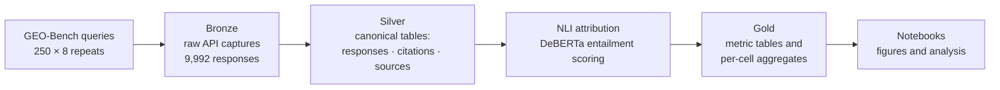

# How Generative Engines Surface and Cite Web Sources: Implications for Content Strategy


A reproducible measurement study of how five generative AI engines — ChatGPT, Claude, Gemini, Kimi, and Perplexity — retrieve, surface, and cite web sources, and what those differences mean for content strategy. The study audits approximately 10,000 engine responses (250 queries × 8 repeats × 5 engines), verifies every citation with natural language inference, models 21 on-page writing features against citation outcomes, and maps the source ecosystem each engine draws upon.

MSc Business Analytics dissertation, Trinity College Dublin, July 2026.

---

## 📄 Abstract

Organic search traffic is declining as users turn to AI-generated answers, and SEO/GEO managers increasingly rely on commercial "AI visibility scores" to track how their content appears in those answers. These scores have two problems: their stability and accuracy have not been demonstrated, and they do not indicate which characteristics of a webpage are associated with faithful and repeated citation by generative engines.

Rather than reproducing commercial scores, this study decomposes AI visibility into three measurable dimensions: **prominence** (Position-Adjusted Word Count, PAWC), **citation accuracy** (Attributable-to-Identified-Sources rate, AIS), and **stability** (coefficient of variation, CV). It audits ~10,000 responses across five engines using 250 GEO-Bench queries repeated eight times each, verifies sentence-level citation support with a DeBERTa NLI model, models twenty-one on-page writing features against citation outcomes, and maps the citation ecosystem at domain level.

The findings suggest the citation opportunity is uneven. ChatGPT, the largest engine by audience, returned no sources on 173 of 250 queries, whilst Perplexity cited on every query. Pages that answered the question early, stayed focused, and remained information-rich earned 4 to 11 percentage points more faithful citation across all five engines. Mid-length, single-topic pages performed best; the longest performed worst. Citation position depended more on source identity than on wording, and repeated readings varied enough that a single score cannot be trusted. One writing playbook transfers across engines. Almost nothing else does, so effort should be allocated engine by engine and measured across repeated runs, not read from a single visibility score.

---

## Research Motivation

- AI-generated answers are replacing traditional ranked search results. By 2028, an estimated $750 billion in US consumer spending is projected to flow through AI-powered search.
- Platforms such as Semrush and Ahrefs now report AI visibility scores, and executives increasingly monitor them, putting pressure on SEO managers to act on numbers whose reliability has not been established.
- Existing scores have important limitations: they blend unpublished components, have not been shown to be stable across repeated measurements, and cannot say whether a citation genuinely supports the claim it accompanies.
- This project develops a reproducible measurement framework that separates AI visibility into prominence, citation accuracy, and stability, then connects those measurements to the writing choices a content team actually controls.

---

## 🎯 Research Questions

1. **RQ1.** Where does the citation opportunity sit across engines, subject areas, and source types?
2. **RQ2.** Which on-page writing choices earn a faithful and repeated citation, and does the skyscraper method still work?
3. **RQ3.** Can a single reading of AI visibility score be trusted?

---

## Key Contributions

- A reproducible AI visibility measurement framework built from three published, recomputable metrics (PAWC, AIS, CV) rather than opaque vendor composites.
- A repeated-query design (k = 8) grounded in published stability evidence and validated against a pilot showing k = 3 is insufficient.
- Sentence-level citation verification using natural language inference, applied uniformly across all five engines.
- Page-feature modelling: 21 on-page writing features tested against early citation, faithful citation, and re-citation, with clustered standard errors and false-discovery-rate correction.
- Source-ecosystem analysis of 58,851 citation events, classifying every citation by website, page depth, and source type.
- An instrument-validation suite covering threshold sensitivity, judging design, and source-truncation exposure.

---

## 📊 Methodology

The research workflow moves from an established query benchmark to verified, aggregated measurements:

- **Queries.** 250 queries drawn from GEO-Bench (Aggarwal et al., 2024), retaining the benchmark's mix of roughly 80% informational, 10% navigational, and 10% transactional queries.
- **Engines.** Five consumer engines queried through their official APIs in free-tier default configuration: ChatGPT 5.5, Gemini 3.1 Flash, Claude Sonnet 4.6, Perplexity Sonar 2, and Kimi 2.6. Web search was neither forced nor suppressed.
- **Repeats.** Each query was run eight times per engine, producing 10,000 responses, of which 9,992 were retained (one query was refused on all eight runs by Kimi's content filter).
- **Citation extraction and source fetching.** Cited URLs were extracted from each response and page text was retrieved and parsed with BeautifulSoup.
- **Entailment scoring.** Each answer sentence was paired with every cited source and scored by a DeBERTa NLI model, classifying citations as supported, borderline, or contradicted.
- **Metrics.** Prominence (PAWC), citation accuracy (AIS), and stability (CV) were computed per engine-query cell and summarised across the eight repeats.
- **Page features and ecosystem.** 21 on-page features were extracted from cited pages and modelled against three citation outcomes per engine; all 58,851 citation events were classified by domain, depth, and source type.

---

## Repository Structure

```
├── thesis_config.py                 Single source of truth for run constants and profiles
├── requirements.txt                 Dependencies (requirements.lock pins exact versions)
├── .env.example                     Template for the engine API keys (copy to .env)
├── run_runpod_nli_pilot.command     Launcher: GPU NLI scoring on RunPod (pilot)
├── run_runpod_nli_scaleup.command   Launcher: GPU NLI scoring on RunPod (scaleup)
├── insights.ipynb                   Cross-cutting narrative figures
├── validation.ipynb                 Instrument-validation figures (Chapter 3)
├── pawc_method_comparison.ipynb     PAWC method comparison
├── RQ analysis                      Per-research-question figure-planning notes
├── Visual_Style_Guide.md            Figure style guide (palette, typography, layout)
├── LICENSE                          MIT licence
├── data/                            Bronze → silver → gold data trees, organised by run profile
├── src/                             Library code: schema, per-engine adapters, builders, metrics
├── scripts/                         Runnable entry points for collection, transformation, and NLI scoring
├── notebooks/                       Per-research-question analysis notebooks (pilot and scaleup)
├── figures/                         Generated figures (PDF and PNG), by run profile
└── docs/                            Methodology notes and dated decision logs
```

- `data/` holds the raw captures, canonical tables, and metric marts for each run profile (pilot and scaleup).
- `src/` contains the shared library: the canonical record schema, one adapter per engine, and the metric implementations.
- `scripts/` are the pipeline entry points, from API collection through NLI attribution.
- `notebooks/` holds the per-research-question analysis notebooks (`pilot/`, `scaleup/`); several cross-cutting notebooks (`insights.ipynb`, `validation.ipynb`, `pawc_method_comparison.ipynb`) sit at the repository root. Together they reproduce every figure and table in the dissertation from the gold-layer data.
- `figures/` stores the rendered outputs referenced in the text.
- `docs/` records methodological decisions with dates and rationale.

---

## Measurement Framework

**Prominence — PAWC (Position-Adjusted Word Count).** How much of an engine's answer a cited page accounts for, with sentences near the start of the answer counting for more. A high value means the answer's early sentences rest on the source; a low value means the engine wrote from its own knowledge or used the source only late in the answer.

**Accuracy — AIS (Attributable-to-Identified-Sources rate).** The share of an answer's sentences that at least one cited source genuinely supports. Sentences with no supporting citation count against the score, so an engine cannot score well by adding unsupported sentences.

**Stability — CV (coefficient of variation).** How far a score moves when the same query is asked again, expressed as a proportion of the score's own average. Where an engine returned no source material on any run, the CV is undefined and the case is kept, because consistent non-retrieval is itself informative.

All three metrics share a common entailment framework: whether a cited page supports the sentence alongside it is judged by one NLI model, applied identically to every engine. Because prominence and accuracy derive from the same entailment judgements, they are analytically related rather than statistically independent.

---

## ⚙️ Data Pipeline

The pipeline follows a bronze → silver → gold medallion architecture:



- **Bronze** stores the raw JSON capture of every engine response, exactly as returned.
- **Silver** converts each engine's format into one canonical record structure (responses, citations, fetched source text), so all engines are measured identically.
- **Gold** holds the entailment-scored sentence and citation tables and the per-cell metric aggregates that the analysis notebooks read.

---

## 📈 Main Findings

**Where the opportunity sits (RQ1)**

- Citation opportunity does not follow audience size. ChatGPT holds the largest audience but retrieved sources on only 24.2% of queries (no sources on 173 of 250), whilst Perplexity retrieved on 100% of queries with the highest prominence (0.46) and citation accuracy (0.79).
- For most Western organisations, Perplexity and Gemini are the primary citation targets; Gemini combines an 87.5% retrieval rate with a large audience.
- Opportunity varies by vertical, and the citation economy has a small shared cross-engine core with engine-private tails.
- The citation unit is the deep reference page, not the homepage: of 58,851 citation events, the overwhelming majority point to deep pages.

**What earns faithful citation (RQ2)**

- One writing standard travels across all five engines: answering the query in the opening lines, question-style titles, and dense, information-rich prose are associated with 4 to 11 percentage points more faithful citation.
- The skyscraper method is not supported in generative search. Faithful citation follows an inverted-U in page length; mid-length, single-topic pages perform best and the longest pages perform worst.
- Freshness opens the gated engines: ChatGPT retrieved on 12% of evergreen queries but 81% of recency-cued ones, with the same direction on Claude (72% → 89%) and Gemini (62% → 92%).
- Citation position is earned at site level. On-page writing predicts faithful citation but has little effect on where a citation lands, which tracks source identity and authority.

**Whether a single score can be trusted (RQ3)**

- It cannot. Engines disagree too much for one blended rank, a citation count is not an accuracy check (a large share of citations fall in the borderline entailment band), and readings change across repeated runs.
- Eight repeats is the minimum viable check count; results should be reported as distributions per engine, not a single blended score.
- Accuracy rankings are stable across every entailment threshold tested; prominence rankings are interpretable only alongside the threshold that produced them.

---

## Technologies

| Layer | Tools |
|---|---|
| Language | Python 3.11 |
| Data handling | Pandas, Parquet, DuckDB |
| Web parsing | BeautifulSoup |
| NLI attribution | PyTorch, Hugging Face Transformers, DeBERTa-v3-large (MNLI) |
| Statistics | statsmodels, SciPy |
| Analysis | Jupyter notebooks |
| Compute | RunPod GPU instances (NLI scoring), local macOS (collection and transformation) |

---

## ⚙️ Reproducibility

The study was designed to be re-runnable end to end.

- **Configuration.** `thesis_config.py` is the single source of truth for every run constant: engines, repeat count, thresholds, paths, and the NLI device.
- **Profiles.** A `RUN_PROFILE` switch (`pilot` / `scaleup`) isolates each experiment's data under `data/{profile}/`, so pilot and main-run artefacts never mix.
- **Pipeline.** Collection scripts write bronze captures; builder scripts produce the canonical silver tables; the NLI scripts generate the gold metric tables. Each stage reads only the previous layer.
- **Determinism where possible.** Query sets are frozen with manifests and seeds, engine model versions are recorded on every call, and default engine settings are held constant.
- **Environment.** Install dependencies with `pip install -r requirements.txt`; exact versions are pinned in `requirements.lock`. NLI scoring requires a CUDA GPU (a 24 GB card is sufficient for DeBERTa-v3-large).
- **Validation.** The instrument-validation checks (threshold sweep, judging-design comparison, truncation exposure) are reproducible from the gold-layer data.

---

## Citation

```bibtex
@mastersthesis{ravindran2026generative,
  author  = {Ravindran, Ganenthra},
  title   = {How Generative Engines Surface and Cite Web Sources:
             Implications for Content Strategy},
  school  = {Trinity College Dublin},
  year    = {2026},
  month   = {July},
  type    = {MSc Business Analytics dissertation}
}
```

---

## License

Released under the MIT License. See `LICENSE` for details.

---

## Acknowledgements

This dissertation was completed as part of the MSc Business Analytics programme at Trinity College Dublin, under the supervision of Dr. George Filippou.
