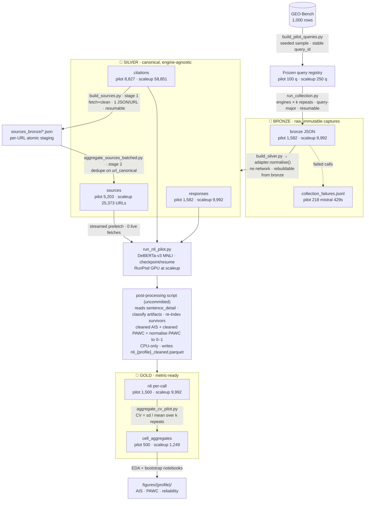
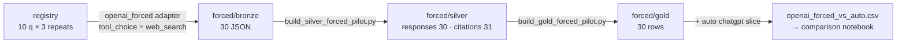

# Thesis Data Pilot — README

**Project:** GEO/AEO visibility pilot — data-sourcing protocol
**Thesis:** *Measuring In-Context Source Visibility and Attribution Across Generative Engines: A Reproducible Multi-Metric Protocol*
**Author:** Ganenthra Ravindran — BU7170, MSc Business Analytics, Trinity College Dublin
**Run profiles:** `pilot` (complete: 100 queries × k=3 × 6 engines, Mistral partial) and `scaleup` (250 queries × k=8 × 5 engines = 9,992 captures, Mistral excluded; **gold complete (V2)** — V2 NLI run (with continuous `source_scores`) + post-hoc correction/normalisation + CV aggregates + τ-sensitivity sweep + entailment-score distribution; only figures/EDA remain)
**Documented:** 2026-06-14 (documentation sync — `scripts/flag_segment_artifacts.py` logged in §8 and the EDA V2/V3 notebooks in §9; data tree reconciled to disk: scaleup run-log + sources tarball + the empty `scaleup_smoke/` husk noted, and the never-created `data/scaleup/forced/` subtree corrected; §18. Earlier: 2026-06-13 scaleup gold complete — NLI run, post-hoc artifact correction + PAWC normalisation, CV aggregation; §19, §5.4. 2026-06-12 scaleup silver + NLI gold-run readiness; post-restructure changes retained)

*This thesis builds a fair, repeatable way to measure how much AI answers show their sources and whether the citations check out — tested across five engines.*

This document is the canonical README for the repository as well as the schema of every data artefact in it. The project follows a **medallion architecture**: `bronze` (raw, immutable API captures) → `silver` (canonical, engine-agnostic records, incl. the per-response NLI tables) → `gold` (dimensional star-schema flat tables + metric-ready aggregates). Two run profiles share the codebase: `pilot` (complete) and `scaleup` (complete through gold — bronze, silver, V2 NLI (with `source_scores`), post-hoc correction, CV aggregation, threshold sweep, and entailment-distribution analysis done; only figures/EDA remain). Each profile owns an isolated subtree under `data/`.

> **Restructure note (this version):** the OpenAI forced-search sensitivity experiment, previously written to a rogue non-profiled top-level `data/{bronze,silver,gold}/` tree, has been consolidated under `data/pilot/forced/`. The legacy husks have been removed; `data/` now contains `pilot/`, `scaleup/`, and an empty `scaleup_smoke/` mirror (the smoke-test profile's data root — created by `cfg.DATA` when `THESIS_RUN_PROFILE=scaleup_smoke`, never populated, carries no analysis artefacts). The structural leakage risk flagged in the previous §15 is therefore *closed on the data side*. The code-side hardcoded paths in `src/adapters/openai_forced_search_adapter.py`, `scripts/build_silver_forced_pilot.py`, `scripts/build_gold_forced_pilot.py`, and `scripts/aggregate_cv_pilot.py` have been fixed — see §15.

> **Medallion layer realignment (2026-06-26).** The scaleup `gold/` layer was reorganised to match medallion best practice. The four **flat tables** (`flat_table1_responses`, `flat_table2_sentences`, `flat_table3_citations`, `flat_table4_entailment_scores`) form a dimensional **star schema** (fact = entailment, dims = responses/sentences/citations) and are the gold consumption layer; the `cell_aggregates_scaleup.parquet` metric mart stays in gold. The two **per-response NLI tables** — `nli_scaleupv2.parquet` (raw, with `source_scores`) and `nli_scaleup_cleaned.parquet` (survivor metrics, §5.4) — are *enriched one-row-per-response entity tables*, i.e. **silver**, and were moved to `data/scaleup/silver/`; the gold star is built from them. The V2 NLI run log moved out of the data layers to `data/scaleup/_ops/nli_scaleup_runv2.log`. The analysis notebooks (`andre_analysis`, `andre_flat_tables`, `pawc_method_comparison`, `test`) were repathed to the silver locations and re-verified. **The pipeline was repointed to match:** `run_nli_pilot.py` now writes the raw NLI table to silver for scaleup (`nli_dir = cfg.SILVER if RUN_PROFILE == "scaleup" else cfg.GOLD` — the frozen pilot still writes to gold), and the `pp_step*` post-processing now reads/writes `nli_scaleupv2`/`nli_scaleup_cleaned` in silver while `cell_aggregates_scaleup.parquet` stays gold. A fresh run therefore re-creates the two NLI tables under `silver/`, consistent with the new layout.

---

## 🔧 Data engineering process — pipeline log & visualisation

The whole pipeline is a single profile-parameterised DAG: one codebase runs both the `pilot` and the `scaleup` profile, selected at runtime by `THESIS_RUN_PROFILE`, with every path derived from `cfg.DATA = data/{profile}`. The diagram below is the end-to-end flow; the table under it logs each transform with its script, I/O, and row counts for both profiles. (GitHub renders the Mermaid block as a diagram.)



**Build state:** the pilot is complete end-to-end (figures produced). Scaleup gold is now **COMPLETE**: the gold NLI run finished (`nli_scaleup.parquet`, 9,992 cells, each carrying `sentence_detail`); the CPU-only post-hoc correction + PAWC normalisation finished (`nli_scaleup_cleaned.parquet`, 9,992 × 20, §5.4 / §19); and CV aggregation finished (`cell_aggregates_scaleup.parquet`, 1,249 cells, §5.2). **Only the scaleup figures/EDA remain.** The gold-run was launched via `run_runpod_nli_scaleup.command` (§11, §17).

### Stage log

| # | Stage | Script(s) | Transform | Input → Output | Pilot | Scaleup | State |
|---|-------|-----------|-----------|----------------|-------|---------|-------|
| 1 | Acquire & freeze queries | `build_pilot_queries.py` | seeded GEO-Bench sample; stable `gb_`+sha256 id; frozen versioned registry (refuses to overwrite) | GEO-Bench 1,000 → registry parquet + manifest + preview | 100 q (seed 20260530) | 250 q (seed 20260606) | ✅ ✅ |
| 2 | Collect (bronze) | `run_collection.py` | engines × k repeats, query-major order, resume-by-bronze-file, retry+backoff, failures logged | registry → one raw JSON per cell | 1,582 (mistral 82/300) | 9,992 (kimi 249/250 cells) | ✅ ✅ |
| 3 | Canonicalise (silver) | `build_silver.py` → `src/silver.py` | `adapter.normalise()` per record → two long tables; no network, rebuildable from bronze | bronze → responses + citations | 1,582 / 8,827 | 9,992 / 58,851 | ✅ ✅ |
| 4 | Fetch source text (stage 1) | `build_sources.py` | fetch + BeautifulSoup-clean each unique URL; 10 workers, per-domain throttle; one atomic JSON/URL; resume skips existing | citations → `sources_bronze/*.json` | 5,203 URLs | 25,373 URLs | ✅ ✅ |
| 5 | Fold sources (stage 2) | `aggregate_sources.py` / `aggregate_sources_batched.py` | dedupe on `url_canonical` → single 8-col parquet (batched/streamed at scaleup volume) | `sources_bronze/` → sources parquet | 82.5% ok | 81.4% ok | ✅ ✅ |
| 6 | NLI attribution (gold, per-call) | `run_nli_pilot.py` | DeBERTa-v3 MNLI support decision per (sentence, source); PAWC + AIS; streamed prefetch (0 live fetches); checkpoint/resume every 200 cells | silver → `nli_{profile}.parquet` | 1,500 | 9,992 | ✅ ✅ |
| 6b | Post-hoc artifact correction + PAWC normalisation | post-processing script (CPU-only; **uncommitted** — see §19) | Reconstruct segments via `segment_sentences()`, classify artifacts via `is_artifact()`, recompute cleaned AIS and cleaned PAWC **from `sentence_detail` survivors** (re-indexed positions), and normalise PAWC to [0,1] via Ω. No GPU. | nli_{profile}.parquet → `nli_{profile}_cleaned.parquet` | — | 9,992 | — ✅ |
| 7 | CV aggregation (gold, per-cell) | `aggregate_cv_pilot.py` | `groupby(engine, query_id)` over k repeats on the **cleaned** metrics; CV = sd/mean; also emits `pawc_norm_{mean,sd,cv}`; expected count derived from collected silver | per-call gold → `cell_aggregates_{profile}.parquet` | 500 | 1,249 | ✅ ✅ |
| 8 | Analysis & figures | `EDA Pilot V3.ipynb`, `bootstrap_convergence_pilot.ipynb` | distributions, per-engine AIS/PAWC, reliability/CV, bootstrap convergence | gold → `figures/{profile}/*.png` | 4 PNG | pending | ✅ ⏳ |

### Forced-search side experiment (§12)

A parallel mini-pipeline on the first 10 queries, isolated under `data/pilot/forced/`:



### Engineering properties (why the process is trustworthy)

- **Profile isolation** — all paths flow from `cfg.DATA = data/{THESIS_RUN_PROFILE}`; pilot and scaleup artefacts can never collide, and the *same* code runs both. Invalid profile/segmenter values fail loudly at import.
- **Medallion reproducibility** — silver and gold rebuild from the immutable bronze + sources parquet with **no network**; collection is the only online stage.
- **Resumability at every expensive stage** — collection skips existing bronze files; `build_sources.py` skips URLs already fetched; the NLI run checkpoints every 200 cells and resumes from `nli_{profile}.partial.parquet`. A killed process never repays work.
- **Atomic writes** — per-URL source JSONs and NLI checkpoints are written `tmp + os.replace`, so a crash can never leave a half-written file.
- **Deterministic measurement instrument** — sentence segmenter pinned to `regex` (verified 1500/1500 vs pilot gold); NLI is an offline DeBERTa model (no API nondeterminism); the residual run-to-run variation is *measured*, not assumed, via CV across the k repeats.
- **Documented, not silent, gaps** — the mistral exclusion and the missing kimi cell each have a dated decision log (`docs/decision_logs/`); the aggregator derives expected cell counts from the silver actually collected, so a real drop/duplicate bug still fails the build while documented gaps pass with a printed note.
- **Post-hoc correctability** — the gold layer retains per-sentence attribution detail (`sentence_detail`), so segmentation correction and re-derivation of **both** metrics (AIS *and* PAWC) are CPU post-processes that never repeat the expensive NLI scoring run. The V2 scaleup gold (`nli_scaleupv2.parquet`, commit 7e33772) stores continuous `source_scores`, so τ **has been** re-swept post-hoc from them (τ ∈ {0.30…0.70}, no GPU re-run; §19) — AIS rankings are stable across τ, PAWC_norm rankings are τ-sensitive. The older V1 gold (`nli_scaleupV1.parquet`, `nli_pilot.parquet`) stores only the binary flag at τ=0.50 and cannot be re-swept.

---

## 1. Top-level layout

```
Thesis Data Pilot/
├── README.md                       This document (canonical README & data schema)
├── thesis_config.py                Single source of truth for every run constant (~13 KB)
├── requirements.txt                Dependencies, grouped by build batch
├── requirements.lock               Pinned exact versions
├── run_runpod_nli_pilot.command    Launcher: run the NLI pilot on a remote RunPod GPU
├── run_runpod_nli_scaleup.command  Launcher: run the NLI SCALEUP gold-run on RunPod (48h timer, checkpoint/resume, scaleup profile)
├── .env / .env.example             API keys (real .env is gitignored)
├── .gitignore                      Excludes .DS_Store, ~$*.xlsx, *~, and sources_*.parquet / sources_bronze/ (100s of MB–GB; never committed)
├── data/                           Data trees, organised by run profile
├── src/                            Library code (schema, adapters, builders, metrics)
├── scripts/                        Runnable entry points (30 scripts; collection, builders, tests, smoke, artifact-flagging)
├── notebooks/                      Analysis notebooks, split by run profile
│   ├── pilot/                      8 pilot notebooks (silver build, PAWC/AIS, EDA + EDA V2/V3, forced, bootstrap)
│   └── scaleup/                    Empty — scaleup analysis notebooks land here
├── figures/                        Output figures, split by run profile
│   ├── pilot/                      4 bootstrap convergence PNGs
│   └── scaleup/                    Empty — scaleup figures land here
├── docs/                           Provenance & methodology working notes
│   └── decision_logs/              Dated, append-only decision records (mistral exclusion; kimi missing cell)
├── analysis/                       Truncation & artifact-flagging analysis only: source_length_by_engine.csv + sentences_with_artifact_flag.parquet. The cleaned NLI parquet lives in data/scaleup/silver/ (relocated from gold 2026-06-26; §1), NOT here (§19).
├── .venv/                          Virtual environment (not tracked)
└── __pycache__/                    Bytecode cache (not tracked)
```

### Data trees

```
data/
├── pilot/                          PROFILED tree (RUN_PROFILE=pilot) — complete
│   ├── bronze/                     1,582 raw JSON captures (query × engine × repeat)
│   ├── silver/                     3 Parquet files (responses + citations + sources) + sources_bronze/ staging
│   │   ├── responses_pilot.parquet              canonical responses (1,582)
│   │   ├── citations_pilot.parquet              canonical citations (8,827)
│   │   ├── sources_pilot.parquet                fetched source text, 1/url (5,203; ~775 MB)
│   │   └── sources_bronze/                      transient per-URL JSON fetch staging (empty once aggregated)
│   ├── gold/                       pilot aggregates + Smoke-Test/ subfolder
│   │   ├── nli_pilot.parquet                  full-pilot NLI attribution (1,500 rows)
│   │   ├── cell_aggregates_pilot.parquet      per-(engine, query) CV aggregates (500 rows)
│   │   └── Smoke-Test/                        earlier attribution-backbone validation runs
│   ├── queries/                    frozen query registry (v1 + v2: Parquet + manifest + CSV)
│   ├── forced/                     OpenAI forced-search sensitivity experiment (§12)
│   │   ├── bronze/openai_forced/   30 raw JSON captures (10 queries × 3 repeats)
│   │   ├── silver/                 responses_forced.parquet + citations_forced.parquet
│   │   ├── gold/                   forced_chatgpt.parquet (30 rows)
│   │   └── openai_forced_vs_auto.csv          forced-vs-auto comparison table (§12)
│   └── collection_failures.jsonl   collection error log (218 mistral 429s)
│
├── scaleup/                        PROFILED tree (RUN_PROFILE=scaleup) — complete through gold (9,992 captures; only figures/EDA remain)
│   ├── bronze/                     9,992 raw JSON captures (250 × 8 × 5 − 8 missing kimi; see §14 + decision log)
│   ├── silver/                     responses_scaleup (9,992) + citations_scaleup (58,851) + sources_scaleup.parquet (25,373 URLs, 81.4% ok, ~3.5 GB; gitignored) + per-response NLI tables nli_scaleupv2.parquet (9,992 × 15, with source_scores) and nli_scaleup_cleaned.parquet (9,992 × 20, §5.4) [moved from gold 2026-06-26 — see realignment note in §1]
│   │   └── sources_scaleup.tar.gz              3.1 GB gzip of the sources parquet for scp/rsync to the GPU host (gitignored; transient transfer artefact)
│   ├── gold/                       dimensional star schema + metric mart: flat_table1_responses (9,992) · flat_table2_sentences (219,897) · flat_table3_citations (58,851) · flat_table4_entailment_scores (1,181,792) · cell_aggregates_scaleup.parquet (1,249 × 16, §5.2)
│   ├── _ops/                       non-layer operational metadata — nli_scaleup_runv2.log (~0.9 MB V2 NLI gold-run log, A100 PCIe pod; moved from gold 2026-06-26; gitignored via *.log)
│   └── queries/                    Contains scaleup_queries_v2.{parquet, _manifest.json, _preview.md}
│       (no forced/ subtree — the scaleup-scale forced experiment is undecided and has not been run; see §17)
│
└── scaleup_smoke/                  PROFILED tree (RUN_PROFILE=scaleup_smoke) — empty mirror; smoke-test profile root, never populated
    ├── silver/                     (empty)
    └── gold/                       (empty)
```

Every artefact below the profile root (`data/{pilot,scaleup,scaleup_smoke}/`) is auto-isolated by the `cfg.DATA = ROOT/data/{RUN_PROFILE}` pattern in `thesis_config.py`.

> **Scaleup gold on-disk naming (`V1` suffix).** The four scaleup gold artefacts have been manually renamed on disk with a `V1` suffix — `nli_scaleupV1.parquet`, `nli_scaleup_cleanedV1.parquet`, `cell_aggregates_scaleupV1.parquet`, and `nli_scaleup_runV1.log` — and are **byte-identical** to the originals (`nli_scaleupV1.parquet` is the same 20,113,173-byte file). `V1` marks the current generation, which **predates the `source_scores` addition** (§19), so it is preserved before any NLI re-run. **The pipeline scripts were not changed:** `run_nli_pilot.py` still writes `cfg.GOLD / f"nli_{cfg.RUN_PROFILE}.parquet"` (= `nli_scaleup.parquet`) and `aggregate_cv_pilot.py` still writes `cell_aggregates_scaleup.parquet`, so the on-disk `V1` names and the code-emitted names now deliberately diverge. **Convention:** elsewhere this README refers to these artefacts by their pipeline-canonical (unsuffixed) names; the on-disk `V1` files are those exact outputs, renamed. In git this surfaced only as a deletion of the force-added `data/scaleup/gold/nli_scaleup.parquet` (`8af120c`) — the new `V1` files are gitignored under `data/scaleup/**`, so they do not appear as untracked. **Update (V2).** The unsuffixed canonical names are now occupied again by the **V2** generation — `nli_scaleupv2.parquet` (the second NLI run, which adds `source_scores`) and its post-processing outputs `nli_scaleup_cleaned.parquet` / `cell_aggregates_scaleup.parquet` (created 2026-06-15/06-20). The `V1` files are retained for provenance; **V2 is the current primary gold**.

---

## 2. Engines under study

Six generative engines across three regions. Configuration is defined once in `thesis_config.py → ENGINES`.

| Key | Provider | Model | API | Grounding | Region |
|-----|----------|-------|-----|-----------|--------|
| `chatgpt` | OpenAI | gpt-5.5-2026-04-23 | Responses | `web_search` tool | US |
| `claude` | Anthropic | claude-sonnet-4-6 | Messages | `web_search_20250305` | US |
| `gemini` | Google | gemini-3.5-flash | generate_content | `google_search` | US |
| `perplexity` | Perplexity | sonar | OpenAI-compatible | inherent | US |
| `kimi` | Moonshot | kimi-k2.6 | OpenAI-compatible | `$web_search` tool loop | China |
| `mistral` | Mistral | mistral-medium-3-5 | Agents API | `web_search` connector | Europe |

Each engine has a dedicated adapter in `src/adapters/` that normalizes its native citation format into the shared canonical shape.

> **`openai_forced`** is a *derived variant* of `chatgpt`, not a seventh engine. It uses the same model and adapter logic but adds `tool_choice={"type": "web_search"}` to force a web search on every call. It is **not** registered in `ENGINES` and is used only for the §12 sensitivity experiment.

---

## 3. Bronze layer — `data/pilot/bronze/`

Raw, verbatim API responses. **Nothing is cleaned or interpreted.** 1,582 JSON files.

**Filename convention:** `{engine}__{query_id}__r{run_index}.json`
e.g. `claude__gb_021e53327e1ee5a9__r1.json`

**Coverage (per engine × 100 queries × 3 repeats = 300 expected each):**

| Engine | Files | Status |
|--------|-------|--------|
| chatgpt | 300 | complete |
| claude | 300 | complete |
| gemini | 300 | complete |
| perplexity | 300 | complete |
| kimi | 300 | complete |
| mistral | 82 | partial — 218 calls failed (see below) |
| **Total** | **1,582** | |

Mistral's shortfall is fully explained by `data/pilot/collection_failures.jsonl` (218 rows, **all** mistral HTTP 429 `web_search rate limit reached`). 82 collected + 218 failed = 300 attempted.

**Common envelope** (every bronze JSON, all engines — mirrors `BronzeRecord` in `src/schema.py`):

| Field | Type | Description |
|-------|------|-------------|
| `query_id` | string | Stable id, `sha256(query_text)[:16]` prefixed `gb_` |
| `engine` | string | Short engine key |
| `run_index` | int | Which repeat (1-based; 1–3) |
| `model_requested` | string | Model id asked for |
| `model_served` | string | Exact model id the API returned (may differ) |
| `timestamp_utc` | string | ISO 8601, UTC |
| `query_text` | string | The verbatim query |
| `request_params` | object | Exact parameters sent (model, tools, reasoning effort, etc.) |
| `raw_response` | object | Full provider payload, verbatim — **shape differs per engine** |

**Engine-specific `raw_response` shapes:**

- **chatgpt** — Responses API object: `raw_response.output[]` with `content[].text` and `annotations[]`. `include: ["web_search_call.action.sources"]` also captures *consulted* (not just cited) sources.
- **claude** — Messages object: `raw_response.content[]` interleaving `server_tool_use` (web_search calls) and text/citation blocks; some blocks carry `encrypted_content`.
- **gemini** — `raw_response.candidates[].content.parts[].text`; sources in `groundingMetadata.groundingChunks`. Also captures `sdk_http_response.headers`.
- **perplexity** — Chat-completions object: `raw_response.choices[].message.content` with inline `[n]` markers; sources in `search_results[]`.
- **kimi** — `raw_response.final_response.choices[].message.content`; sources prompt-elicited (a system prompt requires a numbered "Sources:" list). `request_params` records `citation_mode`, `thinking`, `max_tool_rounds`.
- **mistral** — Agents API: `raw_response.outputs[]` entries of `type: message.output`; citations as interleaved `tool_reference` chunks.

The **forced** bronze (`data/pilot/forced/bronze/openai_forced/`) uses the same envelope and the chatgpt `raw_response` shape; it is documented in §12.

---

## 4. Silver layer — `data/pilot/silver/`

Canonical, engine-agnostic records produced by the adapters (mirrors `CanonicalRecord` in `src/schema.py`). All metric code reads **only** silver, so it runs identically across engines. (String columns are stored as Arrow `large_string`.)

### 4.1 `responses_pilot.parquet` — 1,582 rows × 13 cols

One row per captured response.

| Column | Type | Description |
|--------|------|-------------|
| `query_id` | string | Query id |
| `engine` | string | Engine key |
| `run_index` | int64 | Repeat index |
| `model_served` | string | Exact model id returned |
| `timestamp_utc` | string | ISO 8601 capture time |
| `run_profile` | string | `pilot` / `scaleup` |
| `answer_text` | string | Cleaned answer text |
| `answer_char_len` | int64 | Character count of answer |
| `answer_word_count` | int64 | Word count of answer |
| `n_cited_sources` | int64 | Number of cited sources |
| `n_unique_domains` | int64 | Distinct domains cited |
| `has_citations` | bool | Whether any citation was found |
| `citation_provenance` | string | How citations were obtained (see below) |

### 4.2 `citations_pilot.parquet` — 8,827 rows × 9 cols

One row per cited source (long format; joins to responses on `query_id` + `engine` + `run_index`).

| Column | Type | Description |
|--------|------|-------------|
| `query_id` | string | Query id |
| `engine` | string | Engine key |
| `run_index` | int64 | Repeat index |
| `position` | int64 | 1-based order the citation appeared in the answer |
| `url` | string | Raw cited URL |
| `url_canonical` | string | Normalized/canonical URL |
| `domain` | string | Registered domain |
| `title` | string | Source title |
| `provenance` | string | `provider_certified` (from structured tool output) or `self_reported_prompt_elicited` (parsed from answer text — Kimi only) |

The **forced** silver (`data/pilot/forced/silver/responses_forced.parquet`, `data/pilot/forced/silver/citations_forced.parquet`) shares these exact schemas — see §12.

### 4.3 `sources_pilot.parquet` — 5,203 rows × 8 cols (source-content fetch layer)

The **fetched-and-cleaned text of every cited URL**, one row per *unique* `url_canonical` in `citations_pilot.parquet` (5,203 distinct URLs across the 8,827 citation rows). This is the corpus the NLI attribution step (§5.1) reads source text from, deduplicated so each URL is fetched once. **Built in two stages** (`scripts/build_sources.py` → `scripts/aggregate_sources.py`; see §8) — a resumable per-URL fetch followed by a cheap local fold — so a killed fetch never loses already-downloaded pages. Large on disk (~775 MB) because it carries full `cleaned_text`; it is force-tracked but too large to push to GitHub (scp/rsync to the GPU host instead).

| Column | Type | Description |
|--------|------|-------------|
| `url_canonical` | string | Normalized/canonical URL — the dedupe + join key back to `citations_pilot.parquet` |
| `domain` | string | Registered domain (netloc) |
| `fetch_status` | string | `ok`, `empty_response`, `parse_error`, `timeout`, `connection_error`, `http_{code}` (e.g. `http_403`), or an exception class name |
| `http_status_code` | int64 | HTTP status returned (0 if the request never completed) |
| `content_length` | int64 | Character count of `cleaned_text` (0 on any failure) |
| `cleaned_text` | string | BeautifulSoup-extracted page text (script/style/nav/header/footer stripped, whitespace-collapsed); empty string — never null — on failure. NLI applies its own truncation window downstream. |
| `fetch_timestamp_utc` | string | ISO 8601 fetch time |
| `title_from_html` | string | `<title>` text captured before tag-stripping |

**Fetch outcome (pilot baseline):** 4,291 / 5,203 = **82.5 % `ok`**; the largest failure bucket is `http_403` (593), then `timeout` (98) and `http_404` (74). The cleaning rules mirror `src/attribution.py::fetch_source_text` exactly, so source text is identical to what the live attribution path would have seen.

> **Staging dir `data/pilot/silver/sources_bronze/`** — stage 1 of the build writes one atomic `<sha256(url_canonical)[:16]>.json` per fetched URL here (the resume ledger); stage 2 folds them into the parquet above. The directory is transient (empty once aggregated) and is **not** part of the analysis schema. `scripts/aggregate_sources_batched.py` is a memory-bounded variant of stage 2 that streams the JSONs to the parquet in 2,000-file batches rather than loading them all at once — needed at scaleup volume.

---

## 5. Gold layer — `data/pilot/gold/`

Metric-ready attribution outputs. The gold layer now holds **(a) the real full-pilot outputs** and **(b) a `Smoke-Test/` subfolder of earlier validation runs.**

The two headline metrics throughout:
- **AIS** (Attributable to Identified Sources) — fraction of answer sentences judged supported by ≥1 cited source. *Verifiability.*
- **PAWC** (Per-Answer Weighted Citation) — position-weighted supported-content mass. *Visibility.*

### 5.1 `nli_{profile}.parquet` — 1,500 rows · 15 columns (pilot)

The **full NLI attribution run** (`scripts/run_nli_pilot.py`), computed offline with a DeBERTa MNLI model (no LLM-judge API cost). The pilot run covers **5 engines × 100 queries × 3 repeats = 1,500** (mistral excluded via `cfg.COLLECTION_ENGINES` — its 82-cell coverage is incomplete). For each (sentence, source) pair the source is chunked into overlapping windows and the max entailment probability is taken; a source supports a sentence when that max ≥ the entailment threshold.

> **Output filename & layer:** the driver writes `nli_dir / f"nli_{cfg.RUN_PROFILE}.parquet"`, where `nli_dir = cfg.SILVER` for scaleup and `cfg.GOLD` for the (frozen) pilot — the 2026-06-26 realignment (§1) routes the scaleup per-response NLI table to silver while the pilot keeps its historical gold location (pilot → `data/pilot/gold/nli_pilot.parquet`, scaleup → `data/scaleup/silver/nli_scaleup.parquet`). The pilot artefact was renamed from its legacy `pilot_nli_pilot.parquet` name on 2026-06-12 (git history preserved via `git mv`), so the on-disk name, the driver, the aggregator, and the notebooks are all consistent. Verified: re-running `aggregate_cv_pilot.py` against the renamed file reproduces the committed `cell_aggregates_pilot.parquet` byte-for-byte.
>
> **Sentence segmenter is pinned (instrument of record).** `cfg.SENTENCE_SEGMENTER` defaults to `"regex"` — verified to reproduce the pilot gold's stored `n_sentences` exactly (1500/1500 cells); `"punkt"` matched only 466, confirming the pilot pod used the regex splitter. `segment_sentences()` selects the backend explicitly with **no silent fallback**: requesting `"punkt"` without the NLTK data raises rather than swapping the instrument mid-experiment. The denominator N drives both the AIS rate and every PAWC position weight, so this is a measurement-instrument decision, not a formatting one.
>
> **Crash-safe checkpoint/resume (I/O only — metric math untouched).** Completed cells are persisted to `nli_{profile}.partial.parquet` every `NLI_CKPT_EVERY` cells (default 200) and at the end of each run; on restart, cells already in the partial are skipped, so a pod shutdown costs ≤200 cells of GPU work instead of the whole run. The two variable-schema columns (`pawc_by_source_position`, `fetch_status`) are JSON-encoded in the checkpoint (pyarrow cannot write an all-empty struct column); the final parquet keeps the original struct types. The partial is deleted once the final parquet is written.

| Column | Type | Description |
|--------|------|-------------|
| `engine`, `query_id`, `run_index` | string/string/int64 | Keys |
| `n_sentences` | int64 | Sentences in the answer |
| `n_sources_cited` | int64 | Sources cited |
| `n_sources_fetched_ok` | int64 | Cited sources successfully fetched |
| `ais_supported_sentences` | int64 | Sentences with ≥1 supporting source |
| `ais_rate` | double | Supported ÷ total sentences (verifiability) |
| `sentence_detail` | list<struct> (JSON-encoded in checkpoint) | Per-sentence attribution detail. Each entry: text (str), idx (int, 1-based), wc (int, word count), w (float, position weight = (N-idx+1)/N), supported (bool — the binary support decision at τ=0.50), sources (list of int, supporting source positions), source_scores (list<struct> — **present in the V2 scaleup gold `nli_scaleupv2.parquet` (commit 7e33772, §19)**; the V1 gold `nli_scaleupV1.parquet` and the pilot `nli_pilot.parquet` predate it and lack it): one entry per fetched source — {pos (int, 1-based source position), score (float, continuous entailment probability from DeBERTa)}. The binary fields enable post-hoc artifact correction of **both** AIS and PAWC without GPU re-run — the cleaned AIS numerator and the re-indexed PAWC are both recovered from this column (§5.4, §19); the continuous source_scores additionally enable a post-hoc threshold re-sweep (§19). |
| `pawc_by_source_position` | struct | Map keyed by 1-based source position → that source's position-weighted supported-word mass: for each **sentence** *i* the source supports, add `wc_i · w_i`, where the **sentence**-position weight is `w_i = (n_sentences − i + 1) / n_sentences` (linear decay; first **sentence** = 1.0). Struct has up to 24 position keys, so pyarrow reports this file as **37 leaf columns**. |
| `pawc_total` | double | Sum of `pawc_by_source_position` (visibility) |
| `nli_evaluations` | int64 | Count of sentence × source NLI calls run |
| `input_tokens`, `output_tokens` | int64 | Always 0 — NLI is offline; cost is tracked separately |
| `n_response_words` | int64 | Word count of the answer |

### 5.2 `cell_aggregates_pilot.parquet` — 500 rows × 13 cols

Per-**cell** aggregation (`scripts/aggregate_cv_pilot.py`) that collapses the per-call rows above into one row per `(engine, query_id)` across the k repeats — **500 cells for the pilot** (5 engines × 100 queries × k=3), **1,249 for scaleup** (5 engines × 250 queries × k=8, minus the one absent kimi cell). This is the reproducibility view: **CV = sd / mean** measures relative spread across repeats (lower = more reproducible). For zero-mean cells (engine–query pairs that never cite/support), CV is undefined (NaN) and is **retained as a signal**, not hidden.

> **Shape check tolerates documented collection gaps.** The expected cell count is derived from the `(engine, query_id)` pairs actually present in silver (after the same `cfg.COLLECTION_ENGINES` exclusion), **not** the theoretical N × engines grid — so the absent `kimi/gb_3fcf760b1a2ea4f8` cell (all 8 runs missing) yields 1,249, with a printed note, rather than an assertion failure. A separate `n_runs ≤ cfg.K` guard still catches duplicate-row aggregation bugs. See `docs/decision_logs/2026-06-12_kimi_missing_cell.md`.

| Column | Type | Description |
|--------|------|-------------|
| `engine`, `query_id` | string | Cell keys |
| `pawc_mean`, `pawc_sd`, `pawc_cv` | double | Mean / sd / CV of `pawc_total` across the 3 repeats |
| `ais_mean`, `ais_sd`, `ais_cv` | double | Same for `ais_rate` (skips null-AIS repeats) |
| `n_runs` | int64 | Repeats aggregated for PAWC (3) |
| `n_runs_ais` | int64 | Non-null AIS repeats (≤3) |
| `did_search_rate` | double | Fraction of repeats that cited sources (0, ⅓, ⅔, 1) |
| `citations_consistent` | bool | True iff did-search was identical across all 3 repeats |
| `n_cited_mean` | double | Mean `n_sources_cited` across the 3 repeats |

**Scaleup extension — `cell_aggregates_scaleup.parquet` (1,249 rows × 16 cols).** The scaleup aggregation reproduces the pilot's **13 columns above** (identical names, dtypes, and order) but computes them over the **cleaned** per-call metrics (`cleaned_ais`, `cleaned_pawc_total`; §5.4) rather than the raw ones — so `pawc_mean`/`pawc_sd`/`pawc_cv` and `ais_mean`/`ais_sd`/`ais_cv` here are the cleaned-metric aggregates, computed across the k=8 repeats. It then adds three columns for the normalised PAWC:

| Column | Type | Description |
|--------|------|-------------|
| `pawc_norm_mean` | double | Mean of `pawc_norm` across the k repeats (NaN/M=0 repeats skipped) |
| `pawc_norm_sd` | double | Standard deviation of `pawc_norm` across the repeats |
| `pawc_norm_cv` | double | `pawc_norm_sd / pawc_norm_mean` — relative spread of the normalised per-source-average visibility (lower = more reproducible) |

### 5.3 `Smoke-Test/` — legacy attribution-backbone validation runs

Small validation runs (10 queries × 5 engines) that pre-date the full pilot, kept for provenance. The query × engine pivots cover 5 engines (chatgpt, claude, gemini, perplexity, kimi).

**Parquet aggregates** — `smoke_pawc_ais_pilot.parquet` (50 × 12) is the baseline row-by-row LLM-judge run; schema shared by the variants:

| Column | Type | Description |
|--------|------|-------------|
| `engine`, `query_id`, `run_index` | string/string/int64 | Keys |
| `n_sentences` | int64 | Sentences in the answer |
| `n_sources_cited` | int64 | Sources cited |
| `n_sources_fetched_ok` | int64 | Sources successfully fetched |
| `ais_supported_sentences` | int64 | Sentences judged source-supported |
| `ais_rate` | double | Supported ÷ total sentences |
| `pawc_total` | double | Per-answer weighted citation score |
| `judge_calls` | int64 | LLM judge invocations |
| `input_tokens`, `output_tokens` | int64 | Judge token usage |

- `smoke_pawc_ais_batched_pilot.parquet` (50 × 12) — same schema, batched judging.
- `smoke_pawc_ais_chunked10_pilot.parquet` (50 × 12) — same schema, chunk-of-10 judging.
- `smoke_nli_partial_pilot.parquet` (12 × 8) — early NLI variant: `engine`, `qid18`, `n_sentences`, `src_ok`, `src_cited`, `nli_ais` (double), `nli_pawc` (double), `nli_evals` (int).

**Excel exports (human-readable, multi-sheet)**:
- `smoke_pawc_ais_rowbyrow_pilot.xlsx` — sheets: `row_by_row`, `AIS_q_x_engine`, `PAWC_q_x_engine`, `sources_cited_q_x_eng`, `per_engine_summary`, `queries_legend`.
- `smoke_pawc_ais_batched_rowbyrow_pilot.xlsx` — sheets: `batched_row_by_row`, `orig_vs_batched_cells`, `AIS_batched_q_x_eng`, `AIS_delta_q_x_eng`, `PAWC_batched_q_x_eng`, `per_engine_compare`, `queries_legend`. The `orig_vs_batched` and delta sheets confirm batched judging doesn't shift scores vs. the baseline.

### 5.4 `nli_{profile}_cleaned.parquet` — 9,992 rows × 20 cols (scaleup)

The output of the CPU-only post-hoc step (§6b, §19). It carries **all 15 original `nli_scaleup.parquet` columns unchanged** (including `sentence_detail`) and appends **five derived columns** that correct the segmentation-artifact confound and add a normalised PAWC. No GPU re-run: every new column is recomputed from the retained `sentence_detail` survivors.

| Column | Type | Description |
|--------|------|-------------|
| `n_artifacts` | int64 | Count of non-claim segments in the response — markdown headings, horizontal rules, bare-URL `Sources:` lines, ≤3-word fragments, etc., classified by `is_artifact()` (rules in §19). |
| `cleaned_n` | int64 | `n_sentences − n_artifacts` (= **N\***), the number of surviving real-claim sentences. |
| `cleaned_ais` | double | Supported survivors ÷ N\*, bounded **[0,1]** (NaN when N\*=0). Computed **from `sentence_detail`**: drop artifact entries, re-index survivors k=1…N\*, count those with `supported == True`, divide by N\*. It is **not** `ais_supported_sentences / cleaned_n` — that naive denominator-only shortcut produced rates **>1.0 on 2,915 rows**, because artifact segments *do* score as supported by the NLI model and so inflate the numerator too (§19). |
| `cleaned_pawc_total` | double | Re-indexed position-weighted supported mass. Artifacts dropped, survivors re-indexed k=1…N\*, weight `w*_k = (N\* − k + 1) / N\*`; per source, `Σ_k wc_k · w*_k · supported_k`, then summed over sources. |
| `pawc_norm` | double | `cleaned_pawc_total / (M · Ω)`, bounded **[0,1]** (NaN when M=0), where **M** = `n_sources_fetched_ok` and **Ω** = `Σ_k wc_k · w*_k` over all surviving (non-artifact) sentences. A per-source average: each source's `PAWC_clean(c)/Ω ∈ [0,1]`, averaged across the M fetched sources (§19). |

**Formal definitions (cleaned metrics, τ = 0.5).** The response segments into N raw sentences (regex splitter, §5.1); `is_artifact()` (§19) removes artefacts, leaving the survivor set **S** with **N\*** = |S| sentences, re-indexed *k* = 1…N\* in reading order. **ℓ_k** is survivor *k*'s word count, **w\*_k** = (N\* − *k* + 1)/N\* its linear position weight, **C** the set of fetched-OK cited sources (**M** = |C|), and **e(s_k, c)** the DeBERTa max-window entailment probability of survivor *k* by source *c*. These are the formulas verified bit-exact against the stored columns.

- **(1) Per-source PAWC:** `PAWC(c) = Σ_{k=1..N*} w*_k · ℓ_k · 1[e(s_k, c) ≥ τ]` — summed over *c* ∈ C gives `cleaned_pawc_total`.
- **(2) Normalised PAWC:** `PAWC_norm = ( Σ_{c∈C} PAWC(c) ) / (M · Ω_r)`, where `Ω_r = Σ_{k=1..N*} ℓ_k · w*_k` — stored as `pawc_norm`.
- **(3) AIS:** `AIS = |{ s_k : ∃ c ∈ C with e(s_k, c) ≥ τ }| / N*` — stored as `cleaned_ais`.

Each supporting source independently receives the full `ℓ_k · w*_k` credit (no splitting across co-citing sources); a survivor is counted **once** for AIS regardless of how many sources support it. The **raw** all-sentence variants (`ais_rate`, `pawc_total`; §5.1) apply the same expressions over all N sentences with `w_i = (N − i + 1)/N`, i.e. without artefact removal or survivor re-indexing.

---

## 6. Queries layer — `data/pilot/queries/`

The **frozen query registry** sampled from GEO-Bench (`GEO-Optim/geo-bench`, test split, 1000 rows). Two versions are kept:

- **v1** — 10 queries (initial proof of concept)
- **v2** — 100 queries (the active pilot registry; `frozen: true`)

Each version ships three files — six artefacts in total:

| File | Role |
|------|------|
| `pilot_queries_v1.parquet` / `pilot_queries_v2.parquet` | The frozen registry (10 / 100 rows) |
| `pilot_queries_v1.manifest.json` / `pilot_queries_v2.manifest.json` | Provenance (selection seed, indices, GEO-Bench fingerprint) |
| `pilot_queries_v1.preview.csv` / `pilot_queries_v2.preview.csv` | Plain-text inspection copy of the registry |

These are **correctly profile-scoped**: the `pilot_queries_` stem is literally `{RUN_PROFILE}_queries_`, and `cfg.QUERY_REGISTRY = data/{RUN_PROFILE}/queries/{RUN_PROFILE}_queries_{version}.parquet`, so scaleup automatically expects `data/scaleup/queries/scaleup_queries_*.parquet` with no collision. See §15 for the artefacts that are *not* so lucky.

**Registry Parquet schema** (`pilot_queries_v2.parquet`, 100 rows × 8 columns; pyarrow reports 10 leaves because `tags` and `sources` are nested):

| Column | Type | Description |
|--------|------|-------------|
| `query_id` | string | `gb_` + 16-hex sha256 of query text |
| `query_text` | string | The query |
| `tags` | list<string> | GEO-Bench topic tags |
| `sources` | list<struct> | Reference sources: `{raw_text, url, cleaned_text}` |
| `sugg_idx` | int64 | GEO-Bench suggested-answer index |
| `geobench_index` | int64 | Row index in source dataset |
| `geobench_config` | string | Source config (`test`) |
| `geobench_split` | string | Source split (`test`) |

**Manifest (`pilot_queries_v2.manifest.json`)** records reproducibility metadata: `selection_method: seeded_random`, `seed: 20260530`, the `query_id_scheme`, the list of `selected_indices` and resulting `query_ids`, and a `geobench` block (repo, resolved config/split, `datasets` lib version, num_rows, fingerprint).

---

## 7. Source code — `src/`

Library code; the only engine-specific logic lives in `src/adapters/`.

| File | Role |
|------|------|
| `schema.py` | Canonical dataclasses: `BronzeRecord`, `CanonicalRecord`, `CitedSource`, `ClaimCitationPair` — the shape of all data |
| `env.py` | API-key / environment loading |
| `repro.py` | Reproducibility helpers (seeding, run ids) |
| `geobench.py` | GEO-Bench loading & query-id derivation |
| `silver.py` | Bronze → silver canonicalization (builds the silver Parquets) |
| `attribution.py` | PAWC + AIS attribution backbone (LLM-judge based) |
| `nli_attribution.py` | NLI-based attribution variant (DeBERTa MNLI) — used by the full pilot |
| `adapters/base.py` | Adapter interface |
| `adapters/{openai,claude,gemini,perplexity,kimi,mistral}_adapter.py` | Per-engine response → `CanonicalRecord` normalization |
| `adapters/openai_forced_search_adapter.py` | Subclasses the OpenAI adapter; forces `tool_choice=web_search` and reuses `normalise()` verbatim (§12) |
| `__init__.py`, `adapters/__init__.py` | Empty package markers — required for the `src` / `src.adapters` imports to resolve; must be carried along in any reorg |

---

## 8. Scripts — `scripts/` (30 entry points)

| Script | Purpose |
|--------|---------|
| `verify_setup.py` | Environment / config sanity check (should print PASS) |
| `check_api_access.py` | Verify each engine's API key & access |
| `build_pilot_queries.py` | Build/freeze the query registry from GEO-Bench |
| `run_collection.py` | Main collection driver (queries × engines × repeats → bronze) |
| `build_silver.py` | **Main silver build** — CLI wrapper over `src.silver.build_silver()`: bronze → `responses_{profile}.parquet` + `citations_{profile}.parquet` (§4.1–4.2). Refuses to run unless `THESIS_RUN_PROFILE` is set explicitly. |
| `build_sources.py` | **Source-content fetch, stage 1 of 2** (§4.3): fetch + clean every unique cited URL, atomic one-JSON-per-URL into `silver/sources_bronze/` (resumable — skips URLs already on disk). Parallel (10 workers), per-domain rate-limited. |
| `aggregate_sources.py` | **Source-content fetch, stage 2 of 2** (§4.3): fold `sources_bronze/*.json` into `sources_{profile}.parquet`, dedupe on `url_canonical`. Pure local read, re-runnable. |
| `aggregate_sources_batched.py` | Memory-bounded variant of `aggregate_sources.py`: streams the per-URL JSONs to the parquet in 2,000-file batches (for scaleup volume). |
| `run_scaleup_preflight.py` | Pre-scaleup readiness / preflight checks before launching the scaleup collection. |
| `verify_scaleup_config.py` | Verify the scaleup profile config & expected counts (design-parameter sanity check). |
| `qc_check.py` | Quality-control checks on captured data |
| `diagnose_chatgpt_citations.py` | Debug ChatGPT citation extraction |
| `cost_ledger.py` | Token/cost accounting |
| `smoke_cost_pawc_ais.py` / `smoke_cost_batched.py` / `smoke_cost_chunked.py` | Cost-profiling smoke runs for the attribution metrics |
| `smoke_nli.py` | NLI-attribution smoke run |
| `test_attribution_smoke.py` | Attribution backbone test |
| `run_nli_pilot.py` | **Full NLI driver** (profile-aware) → `gold/nli_{profile}.parquet` (§5.1). Pinned segmenter, prefetched-sources cache (0 live fetches), and checkpoint/resume (`NLI_CKPT_EVERY`, default 200). Runs unchanged on pilot/scaleup; engines filtered via `cfg.COLLECTION_ENGINES`. |
| `aggregate_cv_pilot.py` | **Cross-run CV aggregation** → `gold/cell_aggregates_{profile}.parquet` (§5.2). Expected cell count derived from collected silver (tolerates the documented kimi gap). |
| `flag_segment_artifacts.py` | **Segment-level artifact flagging** (§19). Reconstructs the per-sentence table from `responses_scaleup.parquet` using the pinned `segment_sentences()` instrument, flags each segment via `is_artifact()`, reports the per-engine artifact rate, and — only if rates land within tolerance of expected ground-truth — writes `analysis/sentences_with_artifact_flag.parquet`. Read-only on silver; never modifies originals. Note: this writes the artifact **flag** table, *not* the cleaned gold parquets — the post-processing script that produces those is still uncommitted (§19). |
| `build_silver_forced_pilot.py` | Forced bronze → `data/pilot/forced/silver/{responses,citations}_forced.parquet` (§12) |
| `build_gold_forced_pilot.py` | Forced silver → `data/pilot/forced/gold/forced_chatgpt.parquet` (§12) |
| `test_openai_forced_adapter.py` | Captures the forced bronze + builds `openai_forced_vs_auto.csv` (§12) |
| `test_{openai,claude,gemini,perplexity,kimi,mistral}_adapter.py` | Per-adapter unit tests |

---

## 9. Notebooks — `notebooks/`

Notebooks are split by run profile. All current pilot notebooks live under `notebooks/pilot/`; `notebooks/scaleup/` is empty; the scaleup/tutor-response analysis notebooks live under `notebooks/test/`.

### `notebooks/pilot/` — 8 notebooks

| Notebook | Purpose |
|----------|---------|
| `01_build_silver.ipynb` | Bronze → silver build and inspection |
| `02_pawc_ais_rowbyrow.ipynb` | Row-by-row PAWC/AIS computation |
| `03_batched_vs_orig_rowbyrow.ipynb` | Batched vs. baseline judging comparison |
| `ChatGPT_Forced_vs_Auto_WebSearch.ipynb` | The forced-vs-auto analysis (§12): coverage vs. quality trade-off |
| `EDA Pilot.ipynb` | First exploratory analysis of `nli_pilot.parquet` — see sections below |
| `EDA Pilot V2.ipynb` | Second iteration of the pilot EDA |
| `EDA Pilot V3.ipynb` | **Current / verified pilot EDA** — supersedes V1/V2; adds §10 source-authority tiers feeding the §11 synthesis. The headline numbers here are the ones verified against the gold parquets (earlier draft narrative numbers are stale vs gold). |
| `bootstrap_convergence_pilot.ipynb` | Bootstrap convergence diagnostics for pilot AIS/PAWC estimates |

**`EDA Pilot.ipynb` sections:** (0) setup & load; (1) dataset integrity & design completeness (1,500 = 100×5×3); (2) data-quality flags & caveats; (3) univariate distributions; (4) per-engine comparison (the headline AIS/PAWC tables & charts); (5) reliability across repeats (CV / determinism check); (6) correlations; (7) query-level difficulty & GEO-Bench tag breakdown; (8) PAWC position structure (early positions carry most mass); (9) key takeaways.

### `notebooks/scaleup/` — empty
Reserved for scaleup analysis; the current scaleup notebooks live in `notebooks/test/` (below).

### `notebooks/test/` — 3 notebooks (scaleup attribution analysis)

| Notebook | Purpose |
|----------|---------|
| `andre_analysis.ipynb` | Addresses the tutor's (Andre's) outstanding methodological comments — citation-count distributions, entailment-score distribution, AIS/PAWC threshold sensitivity, the alternative coverage metric, qualitative face-validity. Reads the cleaned gold from `data/scaleup/silver/`; writes figures to `figures/scaleup/`. |
| `andre_flat_tables.ipynb` | Derives the four flat tables (`flat_table1–4`, the gold star schema) from the per-response NLI gold. |
| `test.ipynb` | Cross-check: computes the normalised-PAWC distribution two ways — from the flat tables (T2+T3+T4) and from the cleaned gold (`andre_analysis` source) — confirming they match (n = 7,131, mean 0.4038). |

All three self-locate the project root (the `andre_*` notebooks `os.chdir` up to `data/scaleup/`; `test.ipynb`'s `_resolve` walks up), so they run correctly from `notebooks/test/`.

---

## 10. Figures — `figures/`

Output figures are split by run profile, mirroring the notebooks structure.

### `figures/pilot/` — 4 files

| File | Source notebook | Description |
|------|-----------------|-------------|
| `bootstrap_ais.png` | `bootstrap_convergence_pilot.ipynb` | AIS bootstrap convergence plot |
| `bootstrap_ais_relative.png` | `bootstrap_convergence_pilot.ipynb` | AIS relative bootstrap convergence |
| `bootstrap_pawc.png` | `bootstrap_convergence_pilot.ipynb` | PAWC bootstrap convergence plot |
| `bootstrap_pawc_relative.png` | `bootstrap_convergence_pilot.ipynb` | PAWC relative bootstrap convergence |

### `figures/scaleup/` — empty
Scaleup output figures will land here.

---

## 11. Docs & config

- `docs/data_provenance.md` — working notes that grow into the methods chapter (dataset version, model ids served, collection window, row counts, exclusions).
- `docs/methodology_notes.md` — methodology working notes.
- `docs/decision_logs/` — dated, append-only records of collection/analysis decisions: `2026-06-06_mistral_excluded.md` (engine-level exclusion) and `2026-06-12_kimi_missing_cell.md` (all 8 runs of `kimi/gb_3fcf760b1a2ea4f8` absent — pattern consistent with provider content filtering on a Xi Jinping / PLA query; analyses proceed with 1,249 cells, no imputation).
- `thesis_config.py` — single source of truth. Defines project identity, GEO-Bench source, query-id scheme, the `ENGINES` registry, per-engine pricing (`ENGINE_PRICES`, marked VERIFY), run profiles (`pilot`, `scaleup`, `scaleup_smoke`), data paths (`DATA = ROOT / "data" / RUN_PROFILE`, selected by env var `THESIS_RUN_PROFILE`), the judge model (`claude-haiku-4-5-20251001`) and its knobs, and NLI settings (model `MoritzLaurer/DeBERTa-v3-large-mnli-fever-anli-ling-wanli`, chunking, entailment threshold). Key gold-run constants:
  - `SENTENCE_SEGMENTER` — pinned to `"regex"` (env-overridable); the measurement instrument for sentence count (§5.1).
  - `NLI_DEVICE` — `os.environ.get("NLI_DEVICE", "mps")`; set `NLI_DEVICE=cuda` on RunPod (no code edit needed).
  - `COLLECTION_ENGINES` — the single source of truth for the mistral exclusion (`ENGINES` minus `_EXCLUDED_ENGINES`); every script that needs "active engines" reads this rather than repeating a local exclusion list.
- `run_runpod_nli_pilot.command` — launcher for the **pilot** NLI run on RunPod: SSH check → pod setup (clone, venv, deps, DeBERTa download, CUDA verify) → rsync pilot bronze+silver → single-cell write test → background launch with a 6-hour hard auto-shutdown → retrieval summary. Stops at any failure gate; never pushes to GitHub.
- `run_runpod_nli_scaleup.command` — launcher for the **scaleup** NLI gold-run. Differs from the pilot launcher on every point that was a verified failure mode for scaleup: correct repo URL (`thesis_pilot.git`), force-sync to `origin/main` (no stale clone), profile/device passed via env vars (`THESIS_RUN_PROFILE=scaleup NLI_DEVICE=cuda`, no `sed`), rsyncs only the 3 silver parquets (~3.5 GB, no bronze), a **48h** hard-shutdown timer (~6.7× pilot workload → expect ~30–36h), a config gate (asserts profile=scaleup/device=cuda/segmenter=regex), a prefetched single-cell write test, and resume instructions (pull `nli_scaleup.partial.parquet`, re-run — resume is automatic).

---

## 12. Forced vs Auto Web-Search experiment (`openai_forced`)

A **standalone sensitivity study**, separate from the main pipeline, that probes ChatGPT's structural *zero-citation floor* (it frequently answers from parametric memory without searching).

**Research question:** when ChatGPT is *forced* to call `web_search` on every query, does its citation coverage and attribution quality improve, or does forcing merely manufacture low-quality citations?

**How it works:** `src/adapters/openai_forced_search_adapter.py` subclasses the normal OpenAI adapter and adds `tool_choice={"type": "web_search"}`; all citation parsing (`normalise()`) is inherited unchanged, so forced and auto results are directly comparable. It runs over the **first 10 queries** of the v2 registry × 3 repeats = **30 captures**.

**Profile-scoped data tree** (post-restructure — see header note and §15):

| Stage | Path | Contents |
|-------|------|----------|
| Bronze | `data/pilot/forced/bronze/openai_forced/` | 30 raw JSON (`openai_forced__{qid}__r{n}.json`); same envelope as §3 |
| Silver | `data/pilot/forced/silver/responses_forced.parquet` (30 × 13) · `data/pilot/forced/silver/citations_forced.parquet` (31 × 9) | Built by `build_silver_forced_pilot.py`; schemas identical to §4 |
| Gold | `data/pilot/forced/gold/forced_chatgpt.parquet` (30 rows) | Built by `build_gold_forced_pilot.py`; same column shape as `nli_pilot.parquet` (§5.1) — 13 scalar cols + `pawc_by_source_position` struct (here only 2 position keys → pyarrow reports 15 leaves) |

**Comparison table — `data/pilot/forced/openai_forced_vs_auto.csv`** (30 data rows, joined on `query_id` + `run_index`):

| Column | Type | Description |
|--------|------|-------------|
| `query_id`, `run_index` | string/int | Keys |
| `auto_searched` | bool | Did the normal `chatgpt` run search? |
| `forced_searched` | bool | Did the forced run search? (≈ always true) |
| `auto_n_citations`, `forced_n_citations` | int | Citation counts per mode |

**Headline finding** (from `ChatGPT_Forced_vs_Auto_WebSearch.ipynb`): forcing lifts coverage sharply (≈23% → ≈90% of cells with ≥1 citation) but **degrades quality** — among cited cells AIS falls ≈0.48 → ≈0.18 and PAWC ≈29.6 → ≈13.1, and ≈48% of forced citations point to unfetchable URLs (vs. ≈0% in auto mode). The conclusion: forced searching mostly manufactures citations where the model previously (correctly) cited nothing. *(N=30; a sensitivity probe, not a primary result.)*

---

## 13. Operational logs

- `data/pilot/collection_failures.jsonl` — append-only error log from `run_collection.py`. 218 rows, one JSON object per failed call: `engine`, `query_id`, `run`, `error`, `http_status`. All 218 are mistral HTTP 429 `web_search rate limit reached` — this is the sole cause of mistral's 82/300 partial coverage (§3).

---

## 14. Housekeeping / known issues

| Item | Path(s) | Status |
|------|---------|--------|
| Legacy empty husks from pre-restructure forced tree | `data/bronze/`, `data/silver/`, `data/gold/` | Removed — `data/` now contains only `pilot/` and `scaleup/` |
| macOS Finder cruft | `./.DS_Store`, `scripts/.DS_Store`, `data/.DS_Store`, `data/pilot/.DS_Store`, `data/pilot/gold/.DS_Store` (5×) | `.gitignore` updated to exclude future instances; existing files retained |
| Excel lock temp | `data/pilot/gold/~$smoke_pawc_ais_batched_rowbyrow_pilot.xlsx` | `.gitignore` updated to exclude future `~$*.xlsx`; existing file retained |
| Mixed gold layout | `data/pilot/gold/` mixes real pilot outputs with the `Smoke-Test/` subfolder | Fine as-is; the `Smoke-Test/` label keeps legacy runs quarantined |

---

## 15. Profile scoping & scaleup-readiness (pilot ↔ scaleup leakage map, post-restructure)

The pipeline is meant to be re-pointed at a fresh data tree by flipping `THESIS_RUN_PROFILE` (`pilot` → `scaleup`), which makes `cfg.DATA = data/{RUN_PROFILE}` and cascades to `BRONZE`/`SILVER`/`GOLD`/`QUERY_DIR`. **The data-side leakage risks flagged in the pre-restructure schema are now closed.** Code-side hardcoded paths exposed by the restructure remain and must be fixed before the scaleup collection, aggregate, or forced runs.

### ✅ Data-side: closed by the restructure

| Pre-restructure risk | Status |
|----------------------|--------|
| Forced bronze at `data/bronze/openai_forced/` | Moved to `data/pilot/forced/bronze/openai_forced/` |
| Forced silver Parquets at `data/silver/{responses,citations}_forced.parquet` | Moved to `data/pilot/forced/silver/…` |
| Forced gold at `data/gold/forced_pilot_chatgpt.parquet` | Moved to `data/pilot/forced/gold/…` |
| `data/pilot/openai_forced_vs_auto.csv` not co-located with siblings | Moved to `data/pilot/forced/openai_forced_vs_auto.csv` |
| Empty `data/scaleup/` not prepared | Created as an empty directory mirror; structure documented in §1 and §17 |
| Legacy husks `data/bronze/`, `data/silver/`, `data/gold/` retained | Removed — `data/` is now clean with only `pilot/` and `scaleup/` |

### ✅ Auto-isolated by `cfg.DATA = data/{RUN_PROFILE}` (no change needed)

| Artefact | How it's scoped |
|----------|-----------------|
| `data/{profile}/bronze/`, `silver/`, `gold/`, `queries/` | Derived from `cfg.DATA = ROOT/data/{RUN_PROFILE}` |
| `responses_{profile}.parquet`, `citations_{profile}.parquet` | `run_nli_pilot.py` reads `cfg.SILVER / f"responses_{cfg.RUN_PROFILE}.parquet"` |
| `nli_{profile}.parquet` | `run_nli_pilot.py` writes `cfg.GOLD / f"nli_{cfg.RUN_PROFILE}.parquet"` (stem shortened from `pilot_nli_`; the pilot artefact was renamed to match on 2026-06-12) |
| `{profile}_queries_{ver}.parquet` (+ manifest/preview) | `cfg.QUERY_REGISTRY` is fully profile-derived |
| `data/{profile}/collection_failures.jsonl` | Lives under the profiled tree |

### ✅ Code-side: hardcoded paths — fixed

These hardcoded paths have been updated to use `cfg.DATA`. Documented below for traceability.

| Artefact / script | Was | Fixed to |
|---|---|---|
| `src/adapters/openai_forced_search_adapter.py:35` | `BRONZE_FORCED = ROOT/data/bronze/openai_forced` | Re-route to `cfg.DATA / "forced" / "bronze" / "openai_forced"` |
| `scripts/build_silver_forced_pilot.py:40-42` | Writes `ROOT/data/silver/{responses,citations}_forced.parquet` | Re-route to `cfg.DATA / "forced" / "silver" / "…"` |
| `scripts/build_gold_forced_pilot.py:44-47` | Reads same; writes `ROOT/data/gold/forced_pilot_chatgpt.parquet` | Re-route inputs and output to `cfg.DATA / "forced" / "gold" / "…"` |
| `scripts/aggregate_cv_pilot.py:31-32` | Hardcodes filenames `pilot_nli_pilot.parquet` (in) and `cell_aggregates_pilot.parquet` (out) — only the *directory* is profile-aware | Make both filenames use `f"…_{cfg.RUN_PROFILE}.parquet"` |
| `scripts/test_openai_forced_adapter.py` | Writes `openai_forced_vs_auto.csv` to `cfg.DATA / "openai_forced_vs_auto.csv"` | Re-route to `cfg.DATA / "forced" / "openai_forced_vs_auto.csv"` |

### ⚠️ Naming redundancies (cosmetic, optional)

| Artefact | Issue | Suggested rename (optional) |
|---|---|---|
| ~~`pilot_nli_{profile}.parquet`~~ → `nli_{profile}.parquet` | The `pilot_nli_` prefix was hardcoded, so a scaleup run would have produced the confusingly-named `pilot_nli_scaleup.parquet` | ✅ Resolved — driver stem shortened to `nli_`; scaleup writes `nli_scaleup.parquet`, and the pilot artefact was `git mv`-renamed to `nli_pilot.parquet` (2026-06-12) so driver, aggregator, notebooks, and disk all agree. |
| ~~`forced_pilot_chatgpt.parquet`~~ → `forced_chatgpt.parquet` | `pilot` was baked into the filename redundantly | ✅ Renamed — code paths fixed and file renamed |
| `Smoke-Test/smoke_*_pilot.*` | One-off legacy validation runs with `_pilot` baked in | Harmless; keep quarantined in `Smoke-Test/` to prevent confusion with real scaleup outputs |
| `scripts/build_pilot_queries.py` | `pilot` hardcoded in script name; script is profile-agnostic and produced `scaleup_queries_v2.parquet` under `THESIS_RUN_PROFILE=scaleup` | Rename to `build_queries.py` (cosmetic; query registry is already frozen for this project) |

---

## 16. Key relationships

The rendered process diagram and stage log live in **[§ Data engineering process](#-data-engineering-process--pipeline-log--visualisation)** (top of this README). The ASCII tree below is the same lineage as a quick text reference, annotated with exact artefact paths and row counts.

```
GEO-Bench (1000 rows)
   └─ seeded sample → queries/pilot_queries_v2.parquet (100 queries)
        └─ run_collection.py × 6 engines × 3 repeats
             ├─ bronze/*.json (1,582 raw captures)   [failures → collection_failures.jsonl]
             │    └─ adapters + silver.py
             │         └─ silver/responses_pilot.parquet (1,582)
             │            silver/citations_pilot.parquet (8,827)
             │              ├─ build_sources.py → silver/sources_bronze/*.json (1/url, resumable)
             │              │    └─ aggregate_sources.py → silver/sources_pilot.parquet (5,203; 82.5% ok)
             │              ├─ attribution.py (LLM judge) → gold/Smoke-Test/smoke_*.{parquet,xlsx}
             │              └─ run_nli_pilot.py (NLI, 5 engines; reads sources_pilot) → gold/nli_pilot.parquet (1,500)
             │                   └─ aggregate_cv_pilot.py → gold/cell_aggregates_pilot.parquet (500)
             │                        └─ EDA Pilot.ipynb (results-chapter analysis)
             │
             └─ FORCED branch (openai_forced, tool_choice=web_search; first 10 queries × 3)
                  data/pilot/forced/bronze/openai_forced/ (30)
                    └─ build_silver_forced_pilot.py → data/pilot/forced/silver/{responses,citations}_forced.parquet
                         └─ build_gold_forced_pilot.py → data/pilot/forced/gold/forced_chatgpt.parquet (30)
                              └─ data/pilot/forced/openai_forced_vs_auto.csv + ChatGPT_Forced_vs_Auto_WebSearch.ipynb
```

Join keys throughout: `query_id` + `engine` + `run_index`.

---

## 17. Scaleup configuration & expected counts

The `scaleup` profile is **complete through gold**: 9,992 of 10,000 planned bronze files (8 Kimi failures, §14 + decision log), all three silver parquets (responses 9,992; citations 58,851; sources 25,373 URLs, 81.4% ok), the gold NLI run — now a **V2** run (`nli_scaleupv2.parquet`, with continuous `source_scores`; the V1 run is retained as `nli_scaleupV1.parquet`), launched via `run_runpod_nli_scaleup.command`, §11 — the CPU-only post-hoc correction + PAWC normalisation (`nli_scaleup_cleaned.parquet`, §5.4 / §19), CV aggregation (`cell_aggregates_scaleup.parquet`, §5.2), and the V2-only **τ-sensitivity sweep + entailment-score distribution** (§19). **Only the scaleup figures/EDA remain.** The `data/scaleup/` tree is populated by the same scripts under `THESIS_RUN_PROFILE=scaleup`; the code-side fixes in §15 are applied.

### Design parameters

| Parameter | Pilot | Scaleup |
|---|---|---|
| Query count | 100 (registry v2) | **250** (registry v2) |
| Repeats (k) | 3 | **8** |
| Engines | 6 (chatgpt, claude, gemini, perplexity, kimi, mistral) | **5** (chatgpt, claude, gemini, perplexity, kimi) |
| Mistral status | Partial (82/300; 218 web-search 429s) | **Excluded** |
| Forced sensitivity probe | Run (10 queries × 3 repeats = 30 captures) | Optional, undecided |
| Cost regime | Live calls, no batch | Live calls, no batch |
| NLI judge | DeBERTa-MNLI (offline) | DeBERTa-MNLI (offline) |

### File counts at scaleup (actual where built, expected for gold)

| Layer | Path | Count |
|---|---|---|
| Bronze | `data/scaleup/bronze/` | **9,992 JSON** (250 × 8 × 5 − 8 missing kimi) ✅ |
| Silver responses | `data/scaleup/silver/responses_scaleup.parquet` | **9,992 rows** ✅ |
| Silver citations | `data/scaleup/silver/citations_scaleup.parquet` | **58,851 rows** ✅ |
| Silver sources | `data/scaleup/silver/sources_scaleup.parquet` | **25,373 unique URLs** (81.4% ok; built via `aggregate_sources_batched.py`; ~3.5 GB, gitignored) ✅ |
| Silver NLI (V2, current) | `data/scaleup/silver/nli_scaleupv2.parquet` | **9,992 × 15** (per-response NLI table; each cell's `sentence_detail` includes continuous `source_scores` for the threshold sweep; moved from gold 2026-06-26, §1) ✅ |
| Gold NLI (V1, provenance) | `data/scaleup/gold/nli_scaleupV1.parquet` | **9,992 rows** (each with `sentence_detail`; binary support only) ✅ |
| Silver NLI cleaned (V2) | `data/scaleup/silver/nli_scaleup_cleaned.parquet` | **9,992 × 20** (15 originals + `n_artifacts`, `cleaned_n`, `cleaned_ais`, `cleaned_pawc_total`, `pawc_norm`; §5.4; moved from gold 2026-06-26, §1) ✅ |
| Gold flat tables (star schema) | `data/scaleup/gold/flat_table{1,2,3,4}_*.parquet` | responses **9,992** · sentences **219,897** · citations **58,851** · entailment **1,181,792** (dimensional model; fact = entailment) ✅ |
| Gold cell aggregates (V2) | `data/scaleup/gold/cell_aggregates_scaleup.parquet` | **1,249 × 16** (250 × 5 − 1 absent kimi cell; cleaned metrics + `pawc_norm_{mean,sd,cv}`) ✅ |
| Queries | `data/scaleup/queries/scaleup_queries_v2.{parquet, _manifest.json, _preview.md}` | 250 rows + manifest + preview ✅ |

> The three scaleup gold filenames above carry a manually-appended `V1` suffix (the actual on-disk names; `nli_scaleup_runV1.log` likewise). The pipeline scripts still emit the unsuffixed `nli_scaleup.parquet` / `nli_scaleup_cleaned.parquet` / `cell_aggregates_scaleup.parquet` — see the **Scaleup gold on-disk naming** note under §1's data tree for the full mapping and rationale.

### Pre-scaleup checklist (gold-run readiness)

1. ✅ Code-side fixes applied — forced adapter paths, aggregate filenames, and forced-vs-auto CSV path use `cfg.DATA` (see §15).
2. ✅ Query registry built — `scaleup_queries_v2.parquet` + manifest + preview in `data/scaleup/queries/` (seed 20260606, 250 rows, 80/10/10 intent distribution).
3. ✅ Scaleup silver built — responses (9,992) + citations (58,851) + sources (25,373 URLs); 0 cited URLs missing from the sources parquet (offline-reproducible, "0 live fetches").
4. ✅ Dedicated scaleup launcher — `run_runpod_nli_scaleup.command` (48h timer, scaleup profile via env, silver-only rsync, config gate, prefetched write test, checkpoint/resume).
5. ✅ Segmenter pinned (`regex`, instrument of record) and `NLI_DEVICE` env-overridable to `cuda` (§5.1, §11).
6. ✅ Mistral excluded at scaleup via `cfg.COLLECTION_ENGINES` — the adapter is retained (pilot reproducibility depends on it), just not iterated.
7. ✅ Gold run launched and completed on RunPod via `run_runpod_nli_scaleup.command` (pod with ≥16 GB RAM, since the ~3.5 GB sources parquet inflates in memory during prefetch). `nli_scaleup.parquet` (9,992 cells) retrieved; CPU-only post-hoc correction + PAWC normalisation + CV aggregation then run on Mac (§19).
8. ✅ Gold NLI schema includes `sentence_detail` — each cell in `nli_scaleup.parquet` retains per-sentence text, weight, and support detail, enabling CPU-only post-hoc correction of **both** AIS and PAWC (§19) without repeating the GPU run. **The correction, PAWC normalisation, and CV aggregation are now COMPLETE** — `nli_scaleup_cleaned.parquet` (9,992 × 20, §5.4) and `cell_aggregates_scaleup.parquet` (1,249 × 16, §5.2) are written; only scaleup figures/EDA remain. (The post-processing script that wrote them is not yet committed — §19 open item.)

---

## 18. Structural changelog

A running log of every structural change made to the repository layout after the initial commit. Code changes are tracked in git; this section captures the *why* and *what moved* for directory/file-organisation decisions.

| Date | Change | Detail |
|------|--------|--------|
| 2026-06-05 | Forced-search experiment consolidated under pilot tree | `data/bronze/openai_forced/`, `data/silver/*_forced.parquet`, `data/gold/forced_pilot_chatgpt.parquet`, and `data/pilot/openai_forced_vs_auto.csv` moved to `data/pilot/forced/{bronze,silver,gold}/` and `data/pilot/forced/openai_forced_vs_auto.csv`. Closes the scaleup data-leakage risk documented in §15. |
| 2026-06-05 | `data/scaleup/` mirror created | Empty `data/scaleup/{bronze,silver,gold,queries,forced/{bronze,silver,gold}}/` tree created in preparation for the scaleup run. |
| 2026-06-05 | Legacy empty husks removed | `data/bronze/`, `data/silver/`, `data/gold/` (empty after forced-experiment move) deleted. `data/` now contains only `pilot/` and `scaleup/`. |
| 2026-06-05 | `SCHEMA.md` renamed to `README.md` | The schema document is now the canonical README. The prior pointer-stub `README.md` was deleted. |
| 2026-06-05 | `notebooks/` and `figures/` split into `pilot/` and `scaleup/` subfolders | All 6 existing notebooks moved to `notebooks/pilot/`; all 4 existing figures moved to `figures/pilot/`. `notebooks/scaleup/` and `figures/scaleup/` created empty for future scaleup artefacts. |
| 2026-06-10 | Cosmetic renames and code-path fixes | `forced_pilot_chatgpt.parquet` → `forced_chatgpt.parquet`; five scripts updated to use `cfg.DATA` for forced-tree paths; `aggregate_cv_pilot.py` filenames made profile-aware. |
| 2026-06-10 | Scaleup silver built | `build_silver.py` → `responses_scaleup.parquet` (9,992) + `citations_scaleup.parquet` (58,851); `build_sources.py` (2-stage, resumable) + `aggregate_sources_batched.py` → `sources_scaleup.parquet` (25,373 URLs, 81.4% ok). Sources parquets (775 MB pilot / 3.5 GB scaleup) gitignored — transfer via scp/rsync. |
| 2026-06-12 | NLI gold-run readiness (commit `864a1d4`) | `thesis_config`: pin `SENTENCE_SEGMENTER=regex` (verified 1500/1500 vs pilot gold), `NLI_DEVICE` env-overridable, add `COLLECTION_ENGINES` + `scaleup_smoke` profile, remove dead `cfg_placeholder`. `run_nli_pilot.py`: checkpoint/resume (`nli_{profile}.partial.parquet`, ≤200-cell loss on shutdown), output stem shortened `pilot_nli_` → `nli_`. `aggregate_cv_pilot.py`: expected cells derived from collected silver (tolerates the 1,249-cell kimi gap). New `run_runpod_nli_scaleup.command` launcher. Decision log for the missing `kimi/gb_3fcf760b1a2ea4f8` cell. |
| 2026-06-12 | Pilot gold artefact renamed to match the new driver stem | `git mv data/pilot/gold/pilot_nli_pilot.parquet → nli_pilot.parquet`; the 5 pilot notebooks and `build_gold_forced_pilot.py` comments updated to the new name. Verified: `aggregate_cv_pilot.py` re-run against the renamed file reproduces the committed `cell_aggregates_pilot.parquet` byte-for-byte (500 cells). `run_runpod_nli_pilot.command` and dated decision logs deliberately left untouched (provenance records). |
| 2026-06-12 | `sentence_detail` added to gold schema | nli_attribution.py: attribute_cell_nli() now retains per-sentence text, position, word count, weight, support flag, and supporting sources in a sentence_detail list. Enables post-hoc artifact correction (cleaned AIS denominator, re-indexed PAWC) without GPU re-run. Motivated by discovery of non-uniform segmentation artifact rates (Kimi 47%, Perplexity 4%) that constitute an instrumentation confound for cross-engine comparison. |
| 2026-06-13 | Post-hoc correction, PAWC normalisation, CV aggregation (scaleup) — COMPLETE | Ran CPU-only post-processing on `nli_scaleup.parquet`. Produced `nli_scaleup_cleaned.parquet` (9,992×20) and `cell_aggregates_scaleup.parquet` (1,249×16); no other files. `cleaned_ais` recomputed from `sentence_detail` survivors after the naive denominator-only shortcut produced rates >1.0 on 2,915 rows (artifacts inflate BOTH numerator and denominator). PAWC normalised to [0,1] per-source-average via Ω (NDCG principle; min-max rejected). Rankings stable raw→cleaned for both metrics. Key finding: Kimi 51.9% of supported sentences were artifacts. Threshold sweep confirmed impossible (`sentence_detail` stores binary support, not continuous score). The post-processing script itself is currently uncommitted and should be added to the repo for full reproducibility. |
| 2026-06-14 | Continuous NLI scores stored → post-hoc threshold sweep enabled | `src/nli_attribution.py`: `attribute_cell_nli()` now appends `source_scores` (one `{pos, score}` per fetched source — the continuous DeBERTa entailment probability, rounded to 5 dp) to each `sentence_detail` entry. **Purely additive**: the binary `supported` flag and `sources` list are unchanged, and the NLI model/scoring/threshold are untouched. New `scripts/sweep_thresholds.py` re-derives support at τ ∈ {0.5…0.9} from `source_scores` and recomputes cleaned AIS / cleaned PAWC / normalised PAWC per engine (same artifact-filter + Ω-normalisation as §19), making the τ-sensitivity sweep a CPU post-process for **future** gold runs. The existing `nli_pilot.parquet` / `nli_scaleup.parquet` predate the change and lack `source_scores` — the script detects this from the schema and prints a re-run message. §5.1, §19. |
| 2026-06-14 | Documentation sync — README reconciled to disk | No data/code moved; this is a docs-only pass. Logged the already-committed `scripts/flag_segment_artifacts.py` in §8 (script count 29→30) and the already-committed `EDA Pilot V2.ipynb` / `EDA Pilot V3.ipynb` in §9 (pilot notebook count 6→8; V3 marked current/verified). Reconciled the §1 data tree to the filesystem: noted the gitignored `data/scaleup/silver/sources_scaleup.tar.gz` (3.1 GB transfer tarball) and `data/scaleup/gold/nli_scaleup_run.log` (~0.9 MB), corrected the documented-but-never-created `data/scaleup/forced/` subtree, and added the empty `data/scaleup_smoke/` profile mirror (updating the header's "only pilot/ and scaleup/" claim). The uncommitted post-processing-script caveat (§19) remains open and unchanged. |
| 2026-06-14 | Scaleup gold artefacts renamed on disk with `V1` suffix | Manually renamed the four scaleup gold files: `nli_scaleup.parquet` → `nli_scaleupV1.parquet`, `nli_scaleup_cleaned.parquet` → `nli_scaleup_cleanedV1.parquet`, `cell_aggregates_scaleup.parquet` → `cell_aggregates_scaleupV1.parquet`, `nli_scaleup_run.log` → `nli_scaleup_runV1.log`. Byte-identical; `V1` marks the current pre-`source_scores` generation (§19), preserved before re-running the NLI with the updated `src/nli_attribution.py`. **Pipeline code unchanged** — `run_nli_pilot.py` / `aggregate_cv_pilot.py` still emit the unsuffixed names, so on-disk and code-emitted names now diverge (see the §1 data-tree note + §17). Git shows only a deletion of the force-added `data/scaleup/gold/nli_scaleup.parquet` (`8af120c`); the `V1` files are gitignored under `data/scaleup/**`. Other README references use the pipeline-canonical unsuffixed names. |
| 2026-06-15 | V2 NLI gold run (`source_scores`) | Second scaleup NLI run on an A100 PCIe pod. **Identical NLI computation**; the only change is `source_scores` (continuous entailment probability, 5 dp) added to each `sentence_detail` entry per commit `7e33772`. Output: `nli_scaleupv2.parquet` (9,992 × 15). The V1 gold files are preserved with the `V1` suffix. §5.1, §17. |
| 2026-06-20 | V2 post-processing complete (8-step pipeline) | Ran Steps 0–8 locally (CPU-only). Steps 1–6 mirror V1 (artifact correction, cleaned AIS/PAWC, Ω-normalisation, CV aggregation) and regenerate the unsuffixed `nli_scaleup_cleaned.parquet` (9,992 × 20) + `cell_aggregates_scaleup.parquet` (1,249 × 16). Step 7: threshold sweep at τ={0.30,0.40,0.50,0.60,0.70} — AIS rankings fully stable across all τ, PAWC_norm rankings threshold-sensitive. Step 8: entailment-score distribution (1.18M scores, mean=0.47, 56% in the indecisive [0.30,0.50) band). Position-decay form resolved: Aggarwal uses exponential, thesis uses linear per Lüttgenau (2025). τ=0.50 citation corrected to "classifier default, not literature-prescribed." Stale §19 artifact-rate table corrected to the committed-instrument rates (Kimi 46.06%, ChatGPT 19.83%, …); V1/V2 `is_artifact` verified byte-identical (0/219,897 segments differ). The 8 step scripts (`pp_step0…pp_step8`) remain uncommitted — to be consolidated into `scripts/postprocess_scaleup.py`. §19. |
| 2026-06-26 | Medallion layer realignment — NLI tables gold→silver | Reorganised `data/scaleup/gold/` to medallion best practice. The four flat tables (`flat_table1–4`) are a dimensional **star schema** and remain the gold consumption layer; `cell_aggregates_scaleup.parquet` (metric mart) stays in gold. The two per-response NLI entity tables were moved to silver: `mv gold/nli_scaleupv2.parquet gold/nli_scaleup_cleaned.parquet → silver/` (one-row-per-response, with nested `sentence_detail` — silver by grain). The V2 run log moved to `data/scaleup/_ops/nli_scaleup_runv2.log` (logs are not a data layer). Repathed and re-verified the analysis notebooks (`andre_analysis`, `andre_flat_tables`, `pawc_method_comparison`, `test`) to the silver locations; `test.ipynb` re-executes clean (both PAWC distributions n=7,131, mean 0.4038). Files are gitignored under `data/scaleup/**`, so `mv` is invisible to git. **Pipeline repointed to match (same session):** `run_nli_pilot.py` now selects `nli_dir = cfg.SILVER` for scaleup (pilot still `cfg.GOLD`); `pp_step0/1/2/3_4/5` read `nli_scaleupv2` and `pp_step5` writes `nli_scaleup_cleaned`, `pp_step6/7/8` read `nli_scaleup_cleaned` — all now in silver, while `cell_aggregates_scaleup.parquet` (pp_step6 output) stays in gold. The auxiliary `test_raw_pawc_ais.py` / `test_pawc_norm.py` / `xref_pawc_ais_one_query.py` were repointed too. Verified: `run_nli_pilot.py` parses clean and `pp_step0_inspect.py` loads `silver/nli_scaleupv2.parquet` (9,992 × 15). The `pp_step*` constants are still *named* `GOLD`/`CLEANED` though their paths are now silver (the scripts are slated for consolidation into `scripts/postprocess_scaleup.py`, §19). No V1 files were present on disk (removed in a prior session); their README provenance rows are now stale. |
| 2026-06-26 | Scaleup analysis notebooks gathered into `notebooks/test/` | Created `notebooks/test/` and moved the three scaleup attribution notebooks into it: `andre_analysis.ipynb` (`git mv` from `notebooks/scaleup/`, history preserved), `andre_flat_tables.ipynb`, and `test.ipynb` (from repo root). `notebooks/scaleup/` is empty again. The two `andre_*` notebooks already self-locate the project root via their `os.chdir`-up guard; `test.ipynb`'s `_resolve` was upgraded to walk up `../` so it resolves `data/scaleup/**` from the new depth. Re-executed `test.ipynb` in place — both PAWC distributions still n=7,131. §9 updated. |

---

## 19. Segmentation Artifact Correction and PAWC Normalisation

This phase has **run and completed** (CPU-only, on Mac; **re-run on the V2 gold, 2026-06-20**). It produced exactly two parquet files — `data/scaleup/silver/nli_scaleup_cleaned.parquet` (9,992 × 20, §5.4; relocated to silver 2026-06-26, §1) and `data/scaleup/gold/cell_aggregates_scaleup.parquet` (1,249 × 16, §5.2) — and **no CSVs, notebooks, or other artefacts**. (`analysis/source_length_by_engine.csv` and `analysis/sentences_with_artifact_flag.parquet` were produced separately during the truncation / artifact-flagging analysis; see below and §1.)

### Two problems with raw metrics

**Problem 1 — non-uniform segmentation artifacts.** The regex sentence splitter (`re.split(r'[.!?]\s+', ...)`) treats any token ending in punctuation followed by whitespace as a sentence boundary. This produces non-claim segments — markdown headings (`### 2.`), horizontal rules (`---`), filler phrases (`Great question!`), and — critically for Kimi — the appended `Sources:` block where each URL becomes its own "sentence." The **measured** artifact rate is strongly non-uniform across engines (computed by `scripts/flag_segment_artifacts.py` over the scaleup silver, regex segmenter):

| Engine | Measured artifact rate (V2) |
|--------|------------------------|
| Kimi | 46.06% |
| ChatGPT | 19.83% |
| Claude | 15.73% |
| Gemini | 14.18% |
| Perplexity | 3.69% |

> These are the rates produced by the committed measurement instrument (`scripts/flag_segment_artifacts.py` + `src.attribution.segment_sentences`), reconfirmed by the V2 post-processing (`pp_step1`). Earlier README figures (Kimi 51.5%, ChatGPT 13.6%, Claude 14.7%, Gemini 13.3%, Perplexity 1.8%) were **stale** and never matched the committed classifier — the V1 and V2 `is_artifact` implementations are byte-identical (0 of 219,897 segments differ), so the rates are identical across the V1 and V2 runs.

This is an **instrumentation confound correlated with output formatting**, not a difference in attribution quality, so cross-engine comparisons on raw metrics are biased.

**Problem 2 — spurious NLI support on artifacts (a measurement finding).** The original assumption was that artifact segments would *not* reach the τ=0.50 entailment threshold (so they would only inflate the AIS *denominator*). That assumption is **false**: the DeBERTa MNLI model frequently scores artifact segments — including bare-URL "Sources:" lines — as **supported**, inflating the *numerator* too. Counts of sentences that are **both artifact and supported** (from the post-processing run's reported summary — see the uncommitted-script note below; these figures are *not* stored in either parquet and so are not parquet-verifiable):

| Engine | Artifact ∧ supported | Per response | % of that engine's supported sentences |
|--------|----------------------|--------------|----------------------------------------|
| Kimi | 22,500 | 11.30 | 51.9% |
| Claude | 5,497 | 2.75 | 14.9% |
| Gemini | 4,781 | 2.39 | 15.7% |
| ChatGPT | 707 | 0.35 | 15.8% |
| Perplexity | 106 | 0.05 | 3.2% |

Because **both** the AIS numerator and denominator are artifact-inflated, correcting only one side is wrong — and correcting both is why rankings stay stable (the two inflations partially cancel; see below).

### Code change — `sentence_detail` retained in gold layer

A single edit to `src/nli_attribution.py` (commit `3ff22ec`, "retain sentence_detail in gold layer for post-hoc artifact correction") adds per-sentence granularity to the return value of `attribute_cell_nli()` without altering the NLI computation:

- `sentence_detail = []` initialised before the sentence loop.
- At the end of each loop iteration, a dict is appended: `{text, idx, wc, w, supported, sources}`.
- `"sentence_detail": sentence_detail` added to the return dict immediately before `pawc_by_source_position`.

The NLI model, threshold, scoring, and all other metric values are completely unchanged. Crucially, retaining the **per-sentence support flag and word count** is what makes **both** corrected metrics recoverable post-hoc: the cleaned AIS numerator (survivors with `supported==True`) and the re-indexed cleaned PAWC (survivor weights × word counts × support) are both rebuilt from this one column — without a GPU re-run.

### Post-processing — what actually ran (Phase 6b, CPU-only)

A post-processing script reconstructs the cleaned gold from `nli_scaleup.parquet`. Steps:

1. **Classify artifacts** via `is_artifact()` per segment (rules as implemented in `scripts/flag_segment_artifacts.py`):
   - Empty / whitespace-only → artifact
   - Bare URL (`^https?://\S+$`) → artifact
   - Markdown heading (starts with `#`) → artifact
   - Horizontal rule (3+ repeated `-`, `*`, `=`, or `_`) → artifact
   - Sources / References / Citations header → artifact
   - 3 words or fewer → artifact
   - Pure punctuation or number label → artifact
2. **Cleaned AIS — from `sentence_detail` survivors.** Filter artifacts; re-index survivors `k = 1 … N*` (where `N* = cleaned_n = n_sentences − n_artifacts`); set `cleaned_supported = count of survivors with supported == True`; then `cleaned_ais = cleaned_supported / N*` (NaN if `N* = 0`). Bounded **[0,1]**.

   > **Why not the naive shortcut.** The first attempt computed `cleaned_ais = ais_supported_sentences / cleaned_n` — reusing the stored supported count and only correcting the denominator. This produced rates **>1.0 on 2,915 rows**, because (per Problem 2) artifact segments *are* counted in `ais_supported_sentences`: the numerator still contained support credited to segments that the corrected denominator had already removed. Recomputing the numerator from survivors only is the fix, and it bounds the metric to [0,1] by construction.
3. **Cleaned PAWC — re-indexed.** From `sentence_detail`, drop artifact entries, re-index surviving sentences `k = 1 … N*`, recompute `w*_k = (N* − k + 1) / N*`, and sum `wc_k · w*_k · supported_k` per source → `cleaned_pawc_total`.
4. **PAWC normalisation → [0,1].** `pawc_norm = cleaned_pawc_total / (M · Ω)`, where **M** = `n_sources_fetched_ok` and **Ω** = `Σ_k wc_k · w*_k` summed over **all surviving (non-artifact) sentences**. This is a per-source average bounded **[0,1]**: each source's `PAWC_clean(c)/Ω ∈ [0,1]`, averaged across the M sources. NaN when `M = 0`.

The τ-sensitivity sweep and entailment-score distribution analysis have since run on the V2 gold (CPU-only, no GPU re-run); see "Threshold sweep" and "Entailment score distribution" below.

### PAWC normalisation — rationale

The normalisation mirrors **Aggarwal et al. (2024)**, whose visibility metric expresses each source's contribution as a fraction of the response. Aggarwal used the **total response word count** as the denominator and **split** the shared word count of a co-cited passage among the co-citing sources. This adaptation differs deliberately on three points: it credits support via **NLI entailment** rather than engine-**declared** citation; it gives **each supporting source full credit** (no equal-split) since entailment is a per-source judgement; and it normalises by **Ω** (the total achievable position-weighted mass of the surviving sentences) rather than raw word count.

Normalising by the **theoretical maximum** (Ω) rather than a **dataset-relative** min-max scaling is a deliberate choice following the **NDCG principle** (Järvelin & Kekäläinen, 2002): identical input must always yield identical output. Min-max was **rejected** because it is dataset-relative — it would make a cell's score depend on the rest of the dataset, breaking both reproducibility (RQ3) and cross-engine comparability.

### Result — rankings are stable raw → cleaned

Correcting both inflated sides leaves the engine ordering intact for both metrics (numbers below are **parquet-verified** against `nli_scaleup_cleaned.parquet` unless noted):

- **AIS (cleaned).** Deltas vs. raw range only −0.008 … +0.002, and ranks are unchanged:
  **Perplexity 0.793 > Kimi 0.777 > Claude 0.579 > Gemini 0.511 > ChatGPT 0.120.**
- **PAWC (cleaned).** Largest absolute movement is Kimi **1075 → 635** (the engine with the most `Sources:`-block artifacts), but the rank order is stable (Kimi > Claude > Gemini > Perplexity > ChatGPT).
- **PAWC (normalised).** **Perplexity 0.464** is highest, **Gemini 0.296** lowest — note the per-source-average normalisation reorders relative to raw PAWC totals, since it rewards concentrating support in few fetched sources rather than accumulating absolute mass.
- **Reproducibility (CV medians, from `cell_aggregates_scaleup.parquet`).** Cleaned-AIS CV: **Claude 0.089** (most consistent) to **ChatGPT 1.05** (least). `pawc_norm_cv`: **Claude 0.18** to **Perplexity 0.52**.

**Interpretation — partial cancellation.** Rankings survive correction precisely because the artifact confound inflated *both* the AIS numerator (spurious support, Problem 2) and the AIS denominator (extra segments, Problem 1). Removing artifacts shrinks both, and for AIS the two shrinkages largely offset, so the rate barely moves. PAWC totals drop more (Kimi most, as expected from its artifact rate), but proportionally enough across engines that the order holds.

### ChatGPT M=0 caveat

ChatGPT frequently answers from parametric memory without searching (its structural zero-citation floor, §12). **1,586 of its rows have no successfully fetched sources** (`M = n_sources_fetched_ok = 0`), so for those cells `pawc_norm` (and, where the response also has no surviving sentences, `cleaned_ais`) is undefined. ChatGPT's `pawc_norm`/`cleaned_ais` means are therefore averages over **fewer** cells than the other engines — **report n explicitly** in any per-engine table, and consider a **search-conditional (M>0)** view, consistent with the pilot EDA.

### Edge cases

- **6 rows with `cleaned_n ≤ 0`** — all **Gemini** empty responses; their `cleaned_ais` is **NaN** (no survivors to score).
- **2,861 rows with `M = 0`** — `pawc_norm` is **NaN** for all of them (1,586 ChatGPT, 655 Gemini, 533 Claude, 80 Kimi, 7 Perplexity).

### Threshold sweep — COMPLETE (V2 gold)

The V2 scaleup gold (`nli_scaleupv2.parquet`) stores `source_scores` — the **continuous** per-(sentence, source) DeBERTa entailment probability (one `{pos, score}` entry per fetched source, 5 dp; §5.1). This enabled a **post-hoc τ-sensitivity sweep with no GPU re-run**: for each τ ∈ {0.30, 0.40, 0.50, 0.60, 0.70}, every sentence's supporting sources are re-derived as `[s["pos"] for s in source_scores if s["score"] >= τ]`, and cleaned AIS / cleaned PAWC / normalised PAWC are recomputed with the **same** artifact-filtering, survivor re-indexing, and Ω-normalisation as above.

**Table A — mean cleaned AIS by threshold:**

| Engine | τ=0.30 | τ=0.40 | τ=0.50 | τ=0.60 | τ=0.70 |
|--------|--------|--------|--------|--------|--------|
| chatgpt | 0.1985 | 0.1890 | 0.1200 | 0.1012 | 0.0868 |
| claude | 0.7241 | 0.7177 | 0.5793 | 0.5129 | 0.4597 |
| gemini | 0.6653 | 0.6582 | 0.5107 | 0.4415 | 0.3825 |
| kimi | 0.9515 | 0.9438 | 0.7774 | 0.6837 | 0.6086 |
| perplexity | 0.9922 | 0.9880 | 0.7930 | 0.6974 | 0.6216 |

**Table B — mean PAWC_norm by threshold:**

| Engine | τ=0.30 | τ=0.40 | τ=0.50 | τ=0.60 | τ=0.70 |
|--------|--------|--------|--------|--------|--------|
| chatgpt | 0.9043 | 0.8192 | 0.4216 | 0.3536 | 0.2996 |
| claude | 0.9104 | 0.8500 | 0.4256 | 0.3332 | 0.2745 |
| gemini | 0.7559 | 0.6839 | 0.2965 | 0.2262 | 0.1816 |
| kimi | 0.9222 | 0.8462 | 0.3959 | 0.2913 | 0.2310 |
| perplexity | 0.8248 | 0.7905 | 0.4642 | 0.3748 | 0.3143 |

**Key finding — AIS rankings are completely stable; PAWC_norm rankings are threshold-sensitive.** Across *every* τ, cleaned AIS orders the engines identically — **Perplexity > Kimi > Claude > Gemini > ChatGPT** (zero rank changes). PAWC_norm is not stable: **Gemini is consistently last**, but everything above it reshuffles with τ (at τ=0.30 Kimi leads; at τ=0.50 Perplexity leads; at τ≥0.60 ChatGPT climbs to 2nd). That AIS and PAWC respond so differently to the same threshold move is itself evidence that the two metrics capture genuinely different dimensions — verifiability vs. visibility — rather than restating one signal.

> **τ=0.50 is the classifier's natural decision boundary** — the point at which the entailment class becomes the model's most confident prediction (argmax). It is a conventional default of the DeBERTa probability classifier, **not** a value prescribed by the attribution literature; TRUE (Honovich et al., 2022) deliberately reports threshold-independent ROC-AUC precisely because the optimal operating point is dataset-dependent. The sweep above is a sensitivity check around this default, not a re-selection of τ.

> **Rounding caveat (12 cells).** Entailment scores are stored at 5 dp, but the gold run decided support on the **full-precision** score (`score >= 0.50`; `src/nli_attribution.py`). 12 cells carry a source whose stored score is exactly `0.50000`, rounded up from an unrounded value just below 0.5 — so re-deriving support from the stored value at τ=0.50 re-includes it. The effect is negligible: 3 AIS + 9 PAWC_norm rows differ from the stored binary flags, per-engine mean impact <5e-5. The sweep is internally consistent because it is computed entirely from the stored rounded scores; only the exact reproduction of the stored flag at the 0.50 boundary is affected.

The sweep was run by `pp_step7_threshold_sweep.py` (one of the 8 uncommitted post-processing scripts — see the reproducibility note below).

### Entailment score distribution (Andre Comment 4)

The continuous `source_scores` also characterise how the DeBERTa entailment function behaves across the whole dataset — **1,181,792** (sentence, source) scores (= Σ `nli_evaluations`, parquet-verified). Overall: mean **0.4721**, std **0.2350**, median **0.4380**, p10 **0.1208**, p90 **0.8515**, range [0.0000, 0.9998].

| Engine | count | mean | median | std | p90 |
|--------|-------|------|--------|-----|-----|
| chatgpt | 26,354 | 0.4791 | 0.4326 | 0.2006 | 0.8001 |
| claude | 290,279 | 0.5169 | 0.4515 | 0.2386 | 0.9220 |
| gemini | 375,092 | 0.4112 | 0.4251 | 0.2575 | 0.7931 |
| kimi | 463,909 | 0.4924 | 0.4426 | 0.1992 | 0.8222 |
| perplexity | 26,158 | 0.4815 | 0.4438 | 0.2937 | 0.9512 |

**Artifact vs non-artifact:** artifacts mean **0.4802** (median 0.4423), non-artifacts mean **0.4688** (median 0.4363). Artifacts carry a *higher* mean entailment than real claims — direct confirmation of the spurious-support finding (Problem 2): the NLI model is, if anything, marginally *more* likely to "support" a non-claim fragment than a genuine sentence.

**Distribution shape — strongly peaked at the model's neutral prior.** 33% of all scores fall in [0.40, 0.45) and 46% in [0.40, 0.50). The tail is bimodal: a confident-entailment lump near 0.95–1.0 (5.4%) and a confident-contradiction spike at 0.00–0.05 (8.1%); the mid-range is sparse. Threshold bands: **<0.30 = 14.16%**, **[0.30, 0.50) = 55.81%**, **[0.50, 0.70) = 13.86%**, **≥0.70 = 16.18%**.

**Why this matters.** The ~56% of scores stacked in the indecisive [0.30, 0.50) band sit just below the τ=0.50 cutoff, so the threshold lands on the steep right shoulder of the central mode. Small τ shifts therefore sweep large volumes of (sentence, source) pairs across the decision boundary — which is exactly why PAWC_norm rankings are threshold-sensitive while AIS (an any-supporter rule, far less sensitive to where individual scores fall) is stable. This is empirical support for reporting the sensitivity sweep rather than a single-threshold point estimate.

### Source truncation — documented limitation

Analysis of `sources_scaleup.parquet` (ok-fetched sources only) reveals that the 4,000-character NLI truncation window exposes engines non-uniformly:

| Engine | % sources > 4,000 chars | % sources > 8,000 chars |
|--------|------------------------|------------------------|
| Kimi | 85.2% | 64.2% |
| Claude | 84.5% | 63.1% |
| ChatGPT | 72.8% | 47.6% |
| Perplexity | 64.4% | 42.9% |
| Gemini | 63.4% | 43.1% |

This produces a **conservative (downward) bias** in NLI entailment scores that is not uniform — Kimi and Claude face greater truncation-induced under-attribution. This is documented as a **limitation**, not corrected: expanding the window would require a full GPU re-run, and the bias direction is known (scores are lower bounds, not inflated). (`analysis/source_length_by_engine.csv` holds this breakdown.)

### Adapted PAWC vs. Aggarwal PAWC

| Dimension | This codebase (adapted) | Aggarwal et al. (2024) |
|-----------|-------------------------|------------------------|
| Attribution signal | NLI entailment (model-judged support) | Engine-**declared** citation |
| Multi-source credit | Each supporting source gets **full** credit | Shared word count **split equally** among co-citing sources |
| Segmentation | Artifact-**corrected** (non-claim segments removed) | Segments **assumed** to be claims |
| Denominator | **Ω-normalised** (theoretical-max, per-source average) | Total **response word count** |

> **Position-decay form — resolved.** Aggarwal et al. (2024, Equation 3) use an **exponential** decay `e^(−pos/|S|)`, motivated by search-engine click-through-rate power laws. This codebase uses **linear** decay `(N − i + 1)/N`, following **Lüttgenau et al. (2025)**. The linear form is a deliberate adaptation: the empirical basis for exponential steepness derives from ranked-list CTR behaviour, which does not directly transfer to in-context attribution within a synthesised answer. Both forms are monotonically decreasing with position; the choice is documented as an adaptation, not an oversight.

### Reproducibility note — the post-processing script is uncommitted

> **⚠️ Open item.** The V2 cleaned gold parquets (`nli_scaleup_cleaned.parquet`, `cell_aggregates_scaleup.parquet`) and the threshold-sweep / entailment-distribution analyses were produced by **8 post-processing step scripts that are not yet committed** — `pp_step0_inspect.py`, `pp_step1_artifacts.py`, `pp_step2_cleaned_ais.py`, `pp_step3_4_cleaned_pawc.py`, `pp_step5_save_cleaned.py`, `pp_step6_cv_aggregate.py`, `pp_step7_threshold_sweep.py`, and `pp_step8_score_distribution.py`. Only `scripts/flag_segment_artifacts.py` — which writes the artifact-**flag** table (`analysis/sentences_with_artifact_flag.parquet`), **not** the cleaned gold — is committed. This is a reproducibility gap (RQ3): the gold artefacts cannot currently be regenerated from committed code. **The 8 step scripts should be consolidated into one committable `scripts/postprocess_scaleup.py` before submission.**

### Analytical decision

**Cleaned metrics are the primary analysis basis** for cross-engine comparison. Raw metrics are reported alongside for transparency and to show the magnitude of the artifact effect. Source truncation is acknowledged as a limitation in the methods section with the direction of bias stated explicitly.
